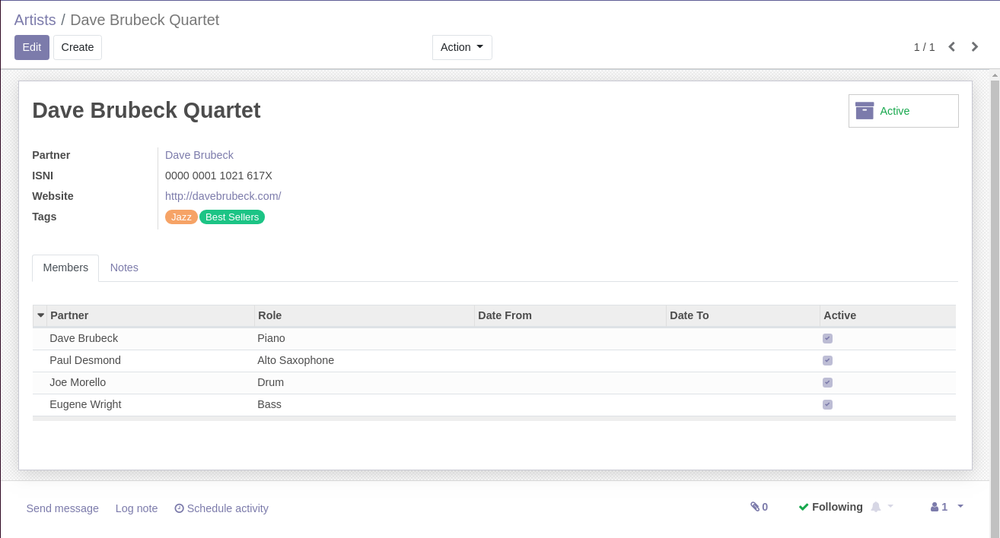
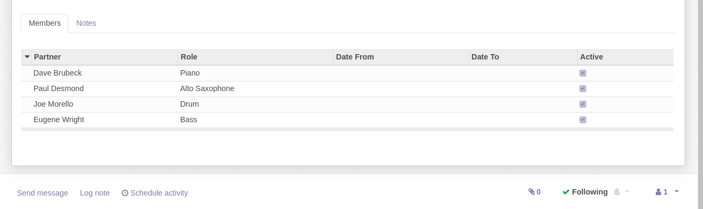

Artist
======
This module adds the concept of an ``Artist`` as an Odoo model.

.. contents:: Table of Contents

An artist is a general designation for an entity in the entertainment.
It can be a humorist, a stage band, an orchestra, a painter, etc.

The term artist does not represent a person.
It designates a group of people (members). It may however be composed of one person.

Context
-------
When designing the module, there was a choice to be made:

1. either a new kind of object for representing artist
2. or otherwise extend `res.partner`

One reason for seperating an artist in a separate model is the ambiguity between
the commercial entity that owns the artist and the artist itself.

Also there is a distinction between the contacts at the commercial entity
and the members of the artist.

Artists
-------
The module defines the form view of an artist.

Partner
~~~~~~~
The field `Partner` of an artist designates the commercial entity (i.e. for invoicing purposes).

Members
~~~~~~~
An artist can have one or more members.

Members are contacts. Each of theme has a role.

Known Issues
~~~~~~~~~~~~
The module defines views for artists, roles and tags.
However, it does not add menu items for accessing these.
We encourage you to add the appropriate menu entries and access rights in a separate module depending on your use case.

Contributors
------------
* Numigi (tm) and all its contributors (https://bit.ly/numigiens)

More information
----------------
* Meet us at https://bit.ly/numigi-com
