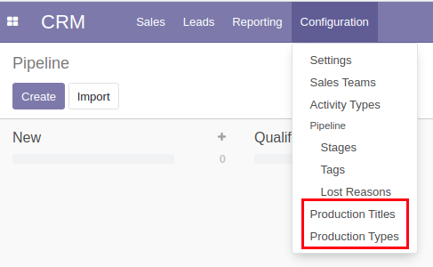
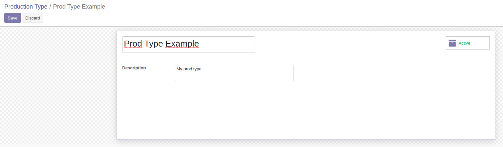
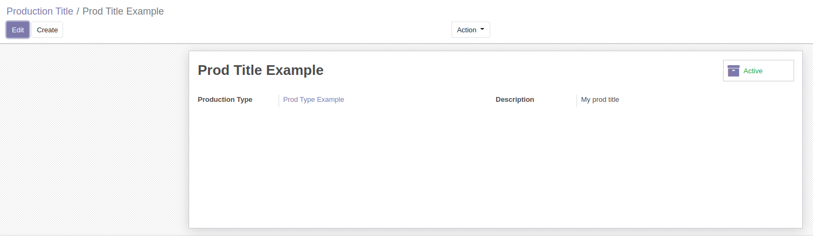
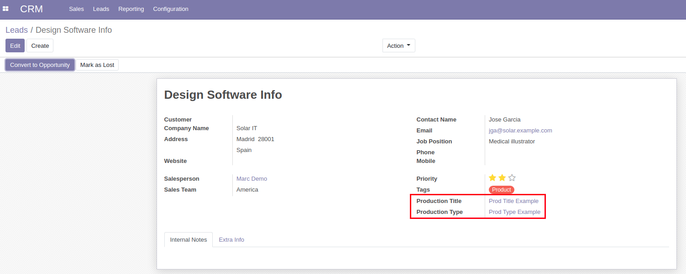

CRM Production Title
====================
This module adds production types and titles to CRM leads.

.. contents:: Table of Contents

Usage
-----
In the CRM configuration submenu, there are now 2 new submenus, production types and production titles.

In the production types submenu, you can create production types with a name and a description.

In the production titles submenu, you can create production titles with a name, a description and a certain production type.

On CRM leads, you can now select a production title, which will then also show its production type.

Configuration
-------------
No configuration is required after installation.

Contributors
------------
* Numigi (tm) and all its contributors (https://bit.ly/numigiens)

More information
----------------
* Meet us at https://bit.ly/numigi-com
