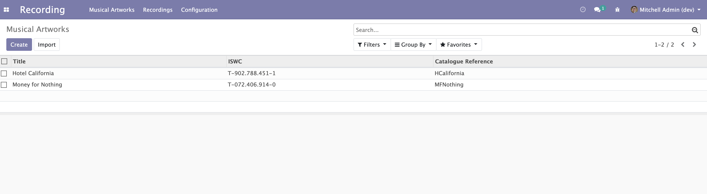
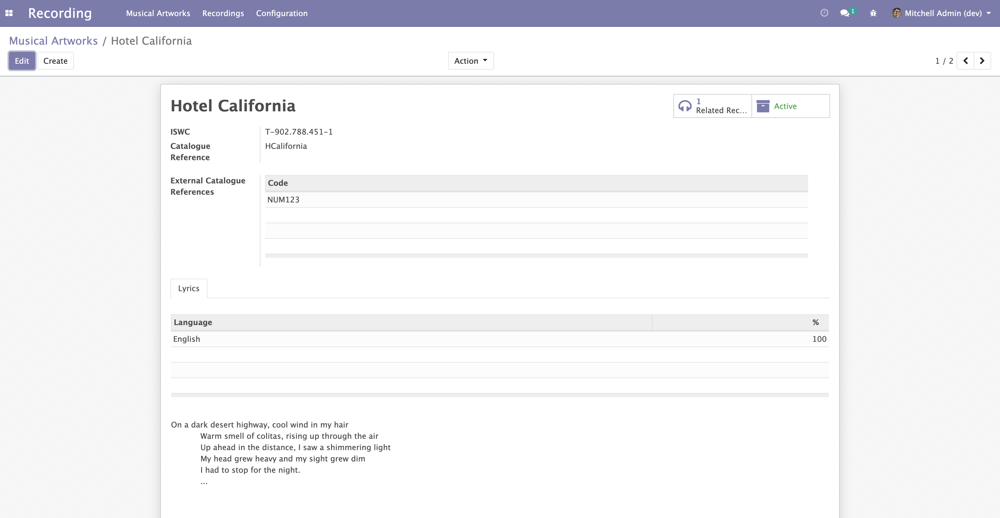
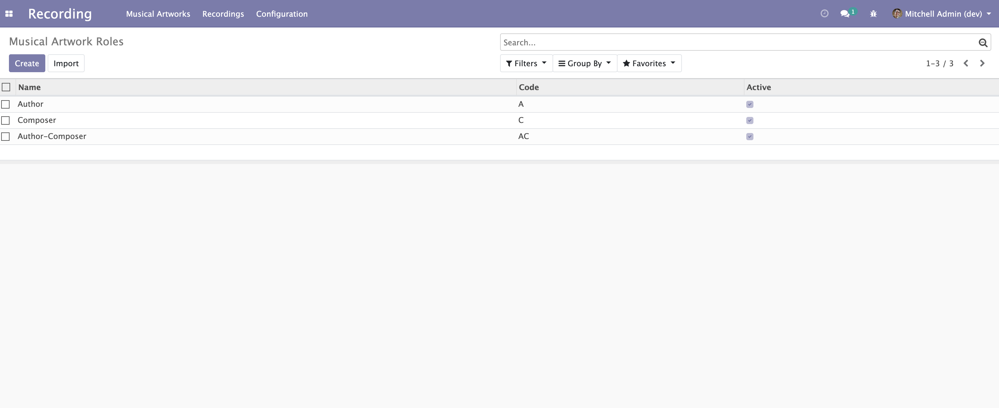

Musical Artwork
===============
This module adds the concept of a ``Musical Artwork`` as an Odoo model.
It also defines the satellite models that enrich musical artwork, such as:

* Roles

.. contents:: Table of Contents

Musical Artworks
----------------
The module defines the list view of a musical artwork.

The module defines the form view of a musical artwork.

Musical Artwork Roles
---------------------
The module defines the list view of a musical artwork role.

Contributors
------------
* Numigi (tm) and all its contributors (https://bit.ly/numigiens)

More information
----------------
* Meet us at https://bit.ly/numigi-com
