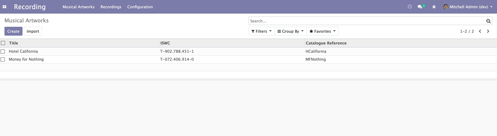
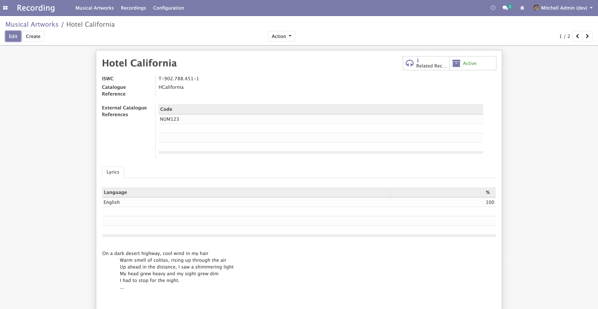
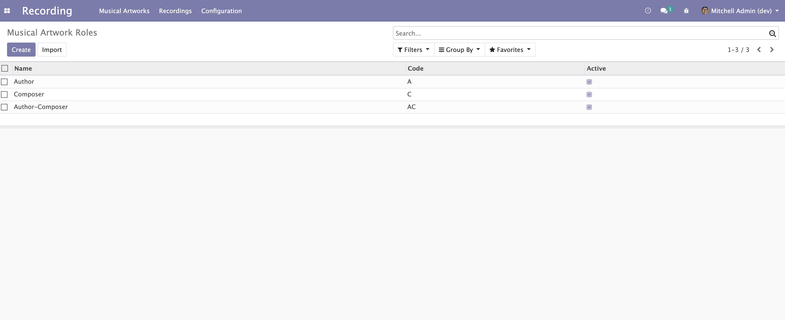

Musical Artwork
===============
This module adds the concept of a ``Musical Artwork`` as an Odoo model.
It also defines the satellite models that enrich musical artwork, such as:

* Roles

.. contents:: Table of Contents

Musical Artworks
----------------
The module defines the list view of a musical artwork.

The module defines the form view of a musical artwork.

Musical Artwork Roles
---------------------
The module defines the list view of a musical artwork role.

Contributors
------------

The `Numigi <https://numigi.com/r/home>`_ team is the contributor to this project. We help Quebec companies implement Odoo and Konvergo ERP.

