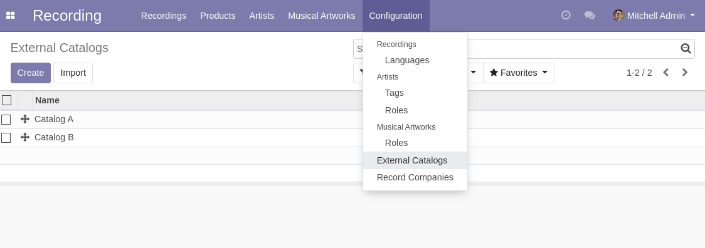

Musical Catalogs
================

This module adds musical catalogs as an Odoo model.

Usage
-----

The configuration of catalogs is available to members of the group ``Recording / Manager``
through the ``Recording / Configuration`` menu:

It shows the list of catalogs.

By clicking on a create button you can create a new catalog.

Module Design
-------------
The module ``musical_catalog`` does not depend on the module ``recording``.
The dependency goes the other way.

The menu item to configure catalogs is added by the module ``recording``.

This allows to use musical catalogs for other purposes without depending on the ``Recording`` app.

Contributors
------------
* Numigi (tm) and all its contributors (https://bit.ly/numigiens)
