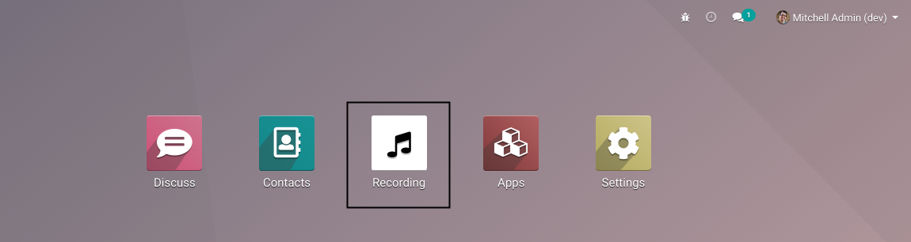
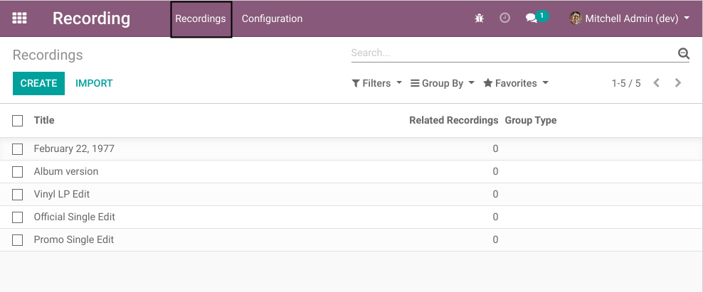
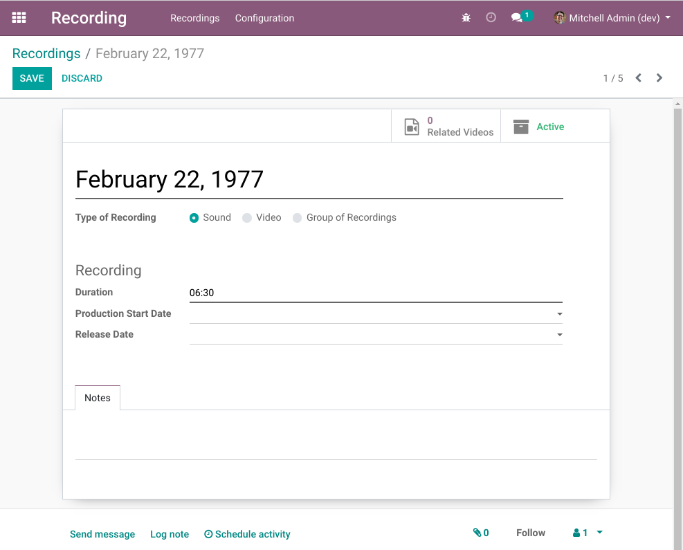

Recording
=========
This module contains the most minimal setup for the recording application.

.. contents:: Table of Contents

Application Panel
-----------------
The Recording application can be accessed through the app panel.

Menus
-----

Recordings
~~~~~~~~~~
This menu item is available to members of the group ``Recording / User``.

.. image:: static/description/recording_menu.png

It shows the list of recordings.

By clicking on a recording, the form view is opened.

Configuration
~~~~~~~~~~~~~
This menu is available to members of the group ``Recording / Manager``.

It contains relevant configuration objects for the application.

When installing only the recording application any optional addon,
it contains the following submenus.

Link Types
**********
See the module `xxx <yyy>`_ for details.

Languages
*********
See the module `xxx <yyy>`_ for details.

Contributors
------------
* Numigi (tm) and all its contributors (https://bit.ly/numigiens)

More information
----------------
* Meet us at https://bit.ly/numigi-com
