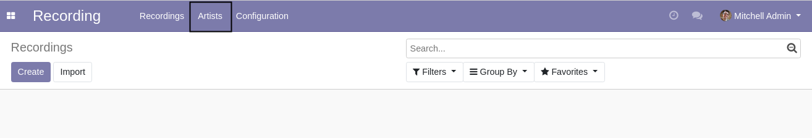

Recording Artist
================
This module adds artists to the recording application.

It also adds the concept of a recording company.

.. contents:: Table of Contents

Menu Entries
------------

Artists
~~~~~~~
In the ``Recording`` application, a menu entry ``Artists`` is added.

When clicking on the menu entries, I see the list view of artists.

Artist Tags and Roles
~~~~~~~~~~~~~~~~~~~~~
Under ``Recording / Configuration`` two new menu entries are added for ``Artist`` ``Tags`` and ``Roles``.

When clicking on ``Tags``, I see the list view of artist tags.

When clicking on ``Roles``, I see the list view (member) of artist roles.

Record Companies
~~~~~~~~~~~~~~~~
Under ``Recordung / Configuration`` a menu entry ``Record Companies`` is added.

This entry allows to configure the list of recording companies.

Recording
---------
In the form view of a recording, I see a new section ``Artist``.

This section allows to define:

* An artist
* A secondary artist
* A record company

This field ``Record Company`` is only visible for recordings of type ``Sound`` and ``Group``.

Contributors
------------
* Numigi (tm) and all its contributors (https://bit.ly/numigiens)

More information
----------------
* Meet us at https://bit.ly/numigi-com
