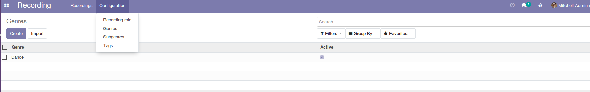
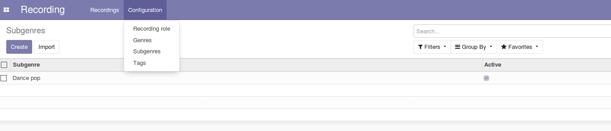
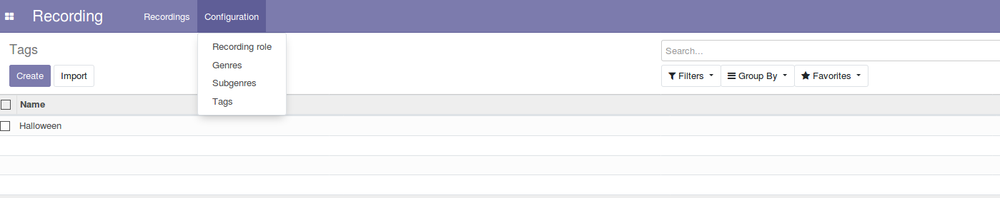
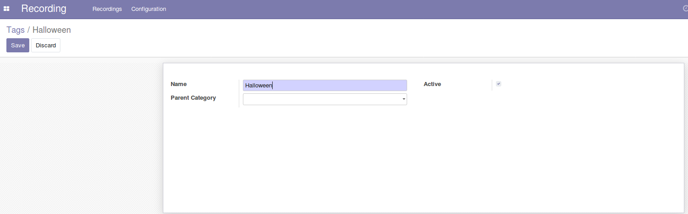

Recording Category
===================

This module allows to manage genres, subgenres and tags for the recording application.

Usage
-----

The configuration genres menu item is available to members of the group ``Recording / Manager``
through the ``Recording / Configuration`` menu:

It shows the list of genres.

By clicking on a create button you can create a new genre.

The configuration subgenres menu item is available to members of the group ``Recording / Manager``
through the ``Recording / Configuration`` menu:

It shows the list of subgenres.

By clicking on a create button you can create a new subgenre.

The configuration tags menu item is available to members of the group ``Recording / Manager``
through the ``Recording / Configuration`` menu:

It shows the list of tags.

By clicking on a tag, the form view is opened.

Contributors
------------
* Numigi (tm) and all its contributors (https://bit.ly/numigiens)
