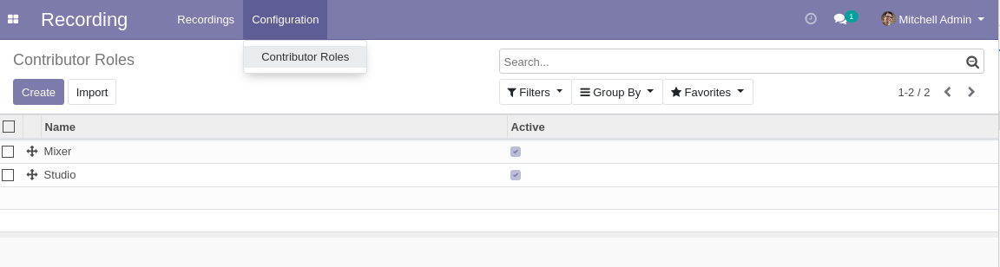
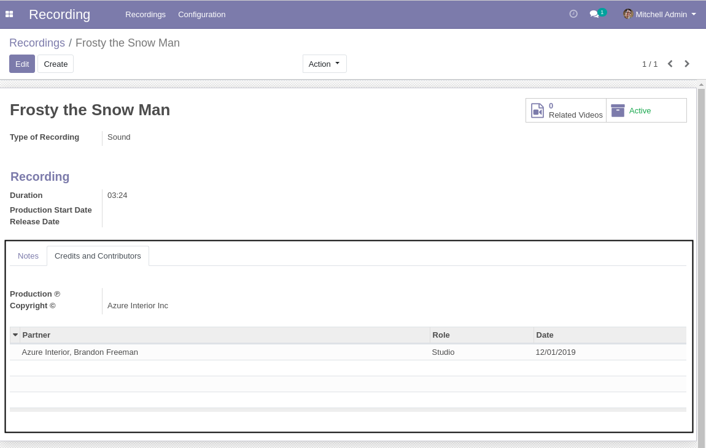

Recording Contributors
======================

This module adds credits and contributors to recordings.

Contributor Roles
-----------------
The configuration Recording Contributor Role menu item is available to members of the group ``Recording / Manager``
through the ``Recording / Configuration`` menu:

It shows the list of Recording Contributor Roles.

By clicking on a create button you can create a new Contributor Role.

Recordings
----------
In the form view of a recording, the tab ``Credits and Contributors`` is added.

This tab has the following elements.

* Production ℗: the sound recording copyright
* Copyright ©: the copyright
* A list of contributors

The contributor list allows to define partners as contributors to the recording.
Each contributor has a recording role and a contribution date.

Contributors
------------
* Numigi (tm) and all its contributors (https://bit.ly/numigiens)
