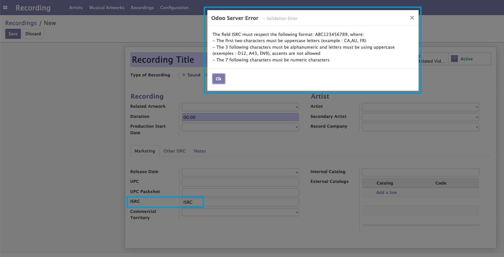
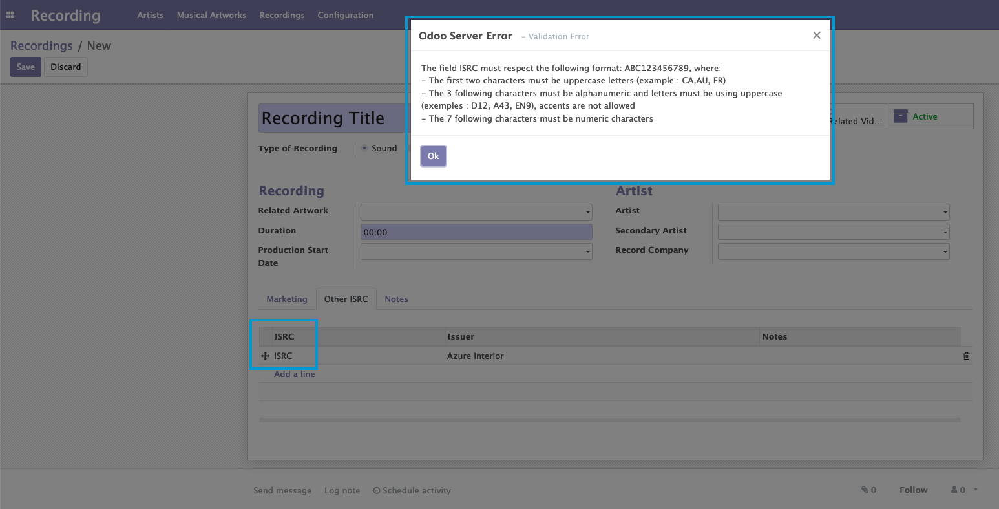

Recording Credential Format
===========================
This modules add constrains to check the value of field `isrc` on model Recording and model Recording Other Isrc

Configuration
-------------
No configuration required apart from module installation.

Contributors
------------
* Numigi (tm) and all its contributors (https://bit.ly/numigiens)
* Komit (https://komit-consulting.com)

More information
----------------
* Meet us at https://bit.ly/numigi-com
