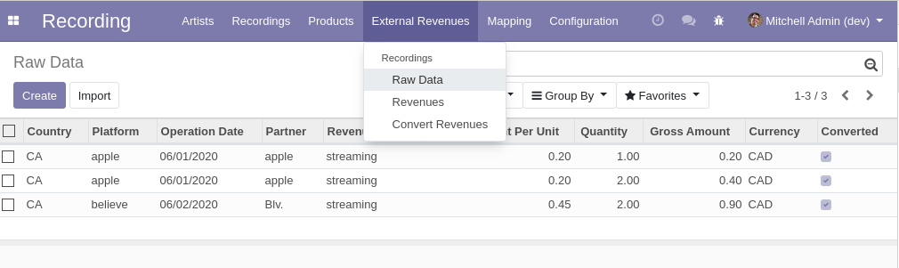
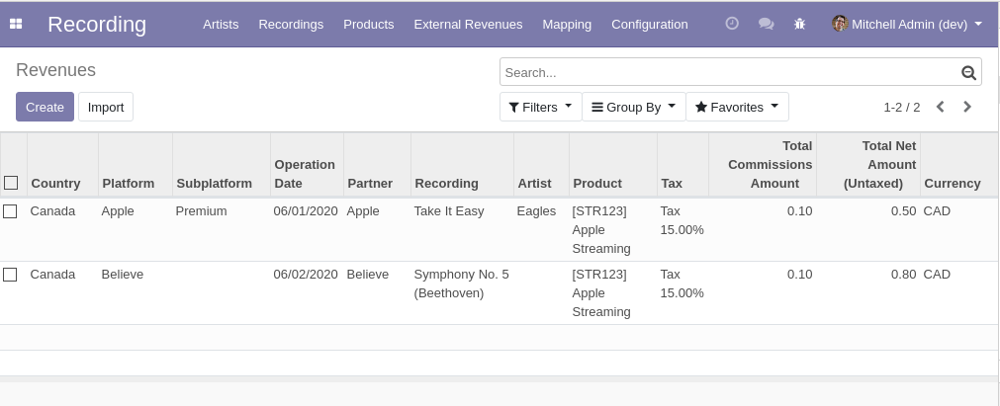

Recording External Revenue
==========================
This module allows to import revenues from external music platforms such
as Apple Music, Sound Exchange or Spotify.

.. contents:: Table of Contents

Overview
--------

Raw Data
~~~~~~~~
The module defines a new model recording.external.revenue.raw.

This model is used to easily upload revenues into Odoo (as csv or xls files).
It is designed to limit manipulations of data outside of Odoo.

It contains mostly dates, strings and numeric fields.
It has only one many2one field (company_id) used for multi-company support.

Revenues
~~~~~~~~
The module defines another model recording.external.revenue.

After raw data entries are imported in Odoo, they can be converted into (real) revenues.

Basic string fields of raw revenues are mapped into many2one values.

Conversion
----------
The conversion of raw entries into revenues is done by clicking on ``Convert Revenues``.

Queue Jobs
~~~~~~~~~~
The conversion is done using queue jobs.

One job is created per revenue.

If a job fails, the error message will be logged inside the job.

Above, the problem is a missing tax mapping entry for the label ``TPS``.

Converted Revenues
~~~~~~~~~~~~~~~~~~
After the jobs have succeeded, the revenues will appear under ``Recording / External Revenues / Revenues``.

Note that in our example, for 3 lines of raw data, 2 lines of revenues were created.

The reason is that the system attempts to group the raw data entries together.

Inside the form view of a revenue, a smart button allows to display
the raw data lines related to this revenue.

Mapping
-------
Here is the detail of how the raw data are converted into revenues.

Mapping Tables
~~~~~~~~~~~~~~
The module defines mapping tables for fields converted with a simple key -> value logic.

These fields include:

* Country
* Country States / Provinces
* Currencies
* Partner
* Recording Platforms
* Recording Subplatforms
* Taxes

The mapping tables for each field can be found under the ``Mapping`` menu.

Below is the mapping table for countries.

If a raw data entry contains the string ``CA`` in its ``Country`` field,
the country of the converted revenue would be ``Canada``.

Mapping of Products
~~~~~~~~~~~~~~~~~~~
Products are mapped using a more specialized logic.

1. If the product reference is filled, it will be used to find a product with a matching internal reference (default_code).

    .. image:: static/description/product_default_code.png

2. Otherwise, if the external catalog reference is filled, it will be used to find the product.

    .. image:: static/description/product_catalog_reference.png

3. Otherwise, the type of revenue will be used to find a matching product.

    .. image:: static/description/revenue_type_mapping.png

    .. image:: static/description/revenue_type_mapping_streaming.png

Mapping of Recordings
~~~~~~~~~~~~~~~~~~~~~
Recordings are also mapped using a specialized logic.

1. If the product mapped at the previous section is related to a record, this record will be used.

    .. image:: static/description/product_recording_relation.png

2. Otherwise, if the ISRC is given, it will be used to identify the record.

3. Otherwise, if the UPC code is given, it will be used.

4. Otherwise, if the external catalog reference is given, it will be used.

    .. image:: static/description/raw_revenue_recording_references.png

    .. image:: static/description/recording_references.png

Since version 1.0.1, amount fields on gross income allows 5 decimal,
on the other hand, the converted income remains on 2 decimal places.

Contributors
------------
* Numigi (tm) and all its contributors (https://bit.ly/numigiens)

More information
----------------
* Meet us at https://bit.ly/numigi-com
