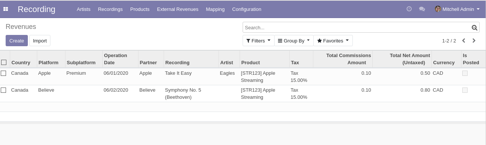
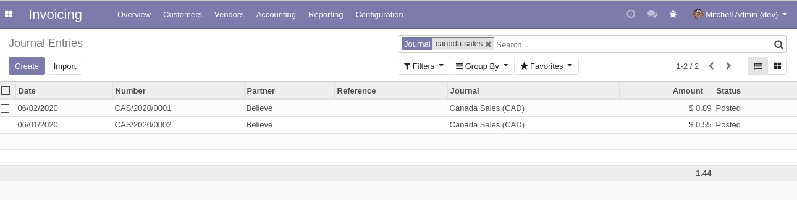
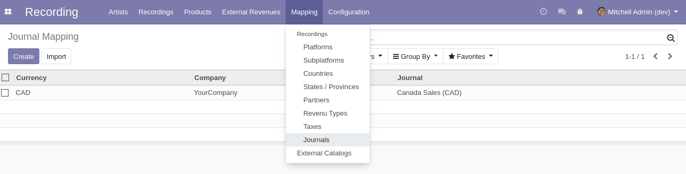
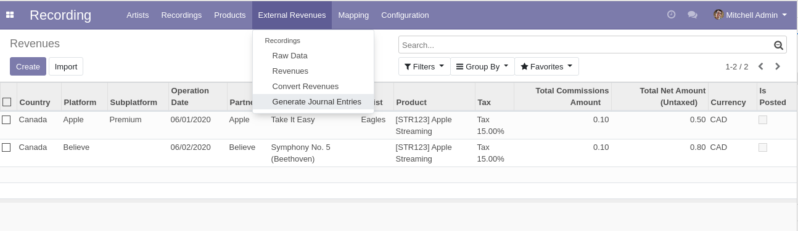
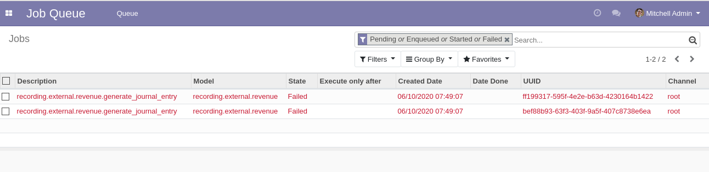
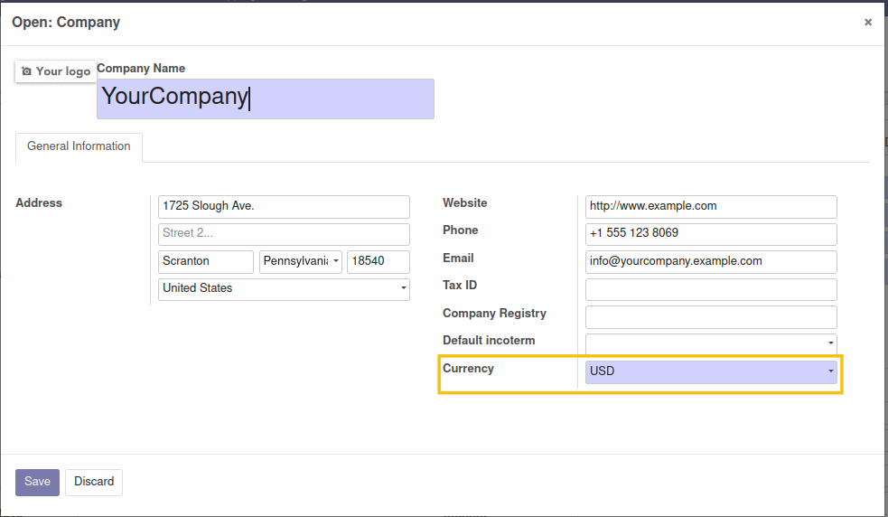
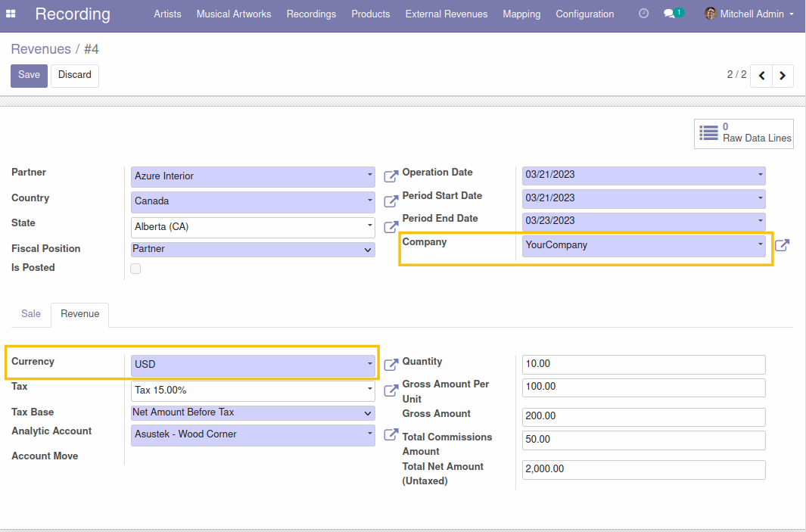
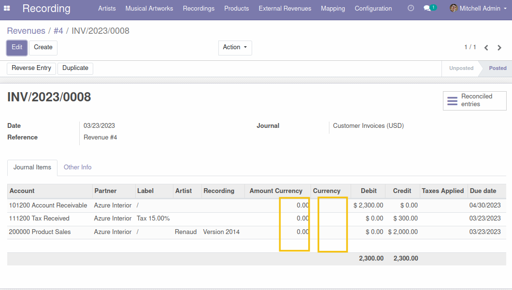
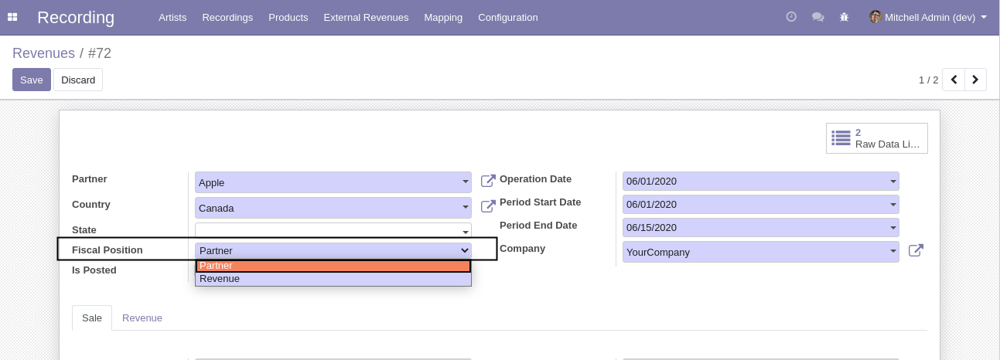
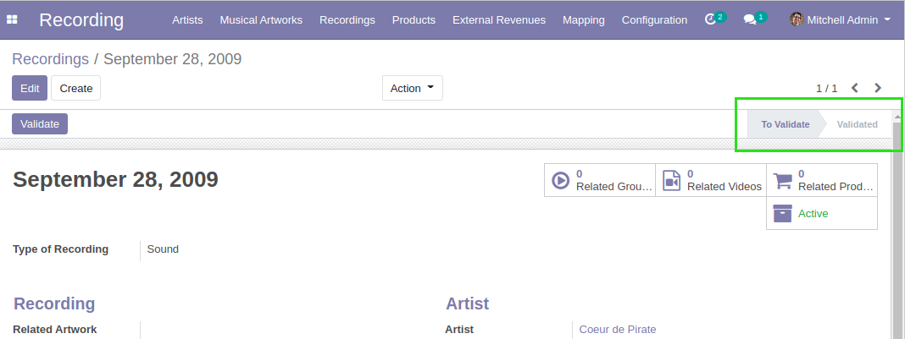

Recording External Revenue Account
==================================
Generate journal entries for recording external revenues.

.. contents:: Table of Contents

Context
-------
The module ``recording_external_revenue`` allows to import recording revenues from external sources.

Overview
--------
This module allows to convert revenues into journal entries.

Configuration
-------------

Journal Mapping
~~~~~~~~~~~~~~~
Under ``Recording / Mapping / Journals``, I find the mapping table used to identify which
accounting journal to use when posting revenues.

It allows to define one journal per currency and company.

Usage
-----
In the ``Recording`` application, I find a new menu entry ``Generate Journal Entries``.

After clicking on the button, one job is created for each revenue of the current company.

Once the jobs have passed, I find a new journal entry for each revenue.

Since version ``1.0.1`` of the module, In case the journal entry has to be created in the company's currency,
the currency and amount currency fields of the journal entry lines are left empty.

We create a new revenue  with a currency that is different from the company's currency.

The fields ``Currency`` and ``Amount currency`` in journal entry lines generated are empty.

How Does It Work
----------------

Fiscal Position
~~~~~~~~~~~~~~~
There are 2 options for identifying the fiscal position of a revenue line.

* Partner: based on the partner defined on the revenue.
* Revenue: based on the country and state defined on the revenue itself.

When posting a revenue, the fiscal position is used to map the taxes and the revenue account.
This works the same way as for a customer invoice.

If the fiscal position is not found for a given revenue, the job will fail with a detailed error message.

Payment Terms
~~~~~~~~~~~~~
The sales payment terms of the partner are used to determinate the due date.

The ``Period End Date`` defined on the revenue is used as date of reference
to compute the due date.

.. image:: static/description/revenue_period_end_date.png

If a partner has no sales payment term, the ``Period End Date`` is used as due date.

Currencies
~~~~~~~~~~
The ``Date of Operation`` defined on the revenue is used to determine the currency rate to apply in the journal entry.

Other Constraints
~~~~~~~~~~~~~~~~~

Deprecated Account
******************
If a journal account used for posting a revenue is deprecated, the job will fail with a detailed error message.

Recording Status
****************
If the recording is not validated, the job will fail with an error message.

Contributors
------------
* Numigi (tm) and all its contributors (https://bit.ly/numigiens)
