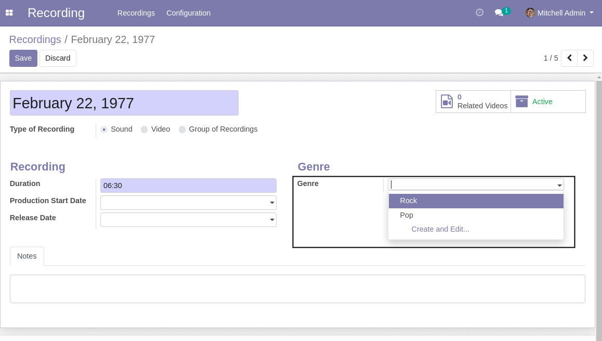

Recording Genres
================

This module adds recording genres.

Usage
-----

The configuration genres menu item is available to members of the group ``Recording / Manager``
through the ``Recording / Configuration`` menu:

It shows the list of genres.

.. image:: static/description/genres.png

By clicking on a create button you can create a new genre of recording.

Recording
---------
On the form view of a recording, a field is added to select the genre of recording.

This field is only visible for recordings of type ``Sound`` and ``Group``.

Contributors
------------
* Numigi (tm) and all its contributors (https://bit.ly/numigiens)
