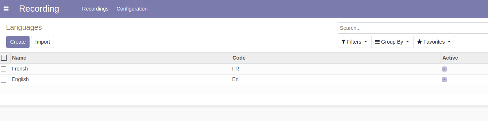

Recording Languages
===================

This module recording languages as an Odoo model.

Usage
-----

The configuration languages menu item is available to members of the group ``Recording / Manager``
through the ``Recording / Configuration`` menu:

It shows the list of languages.

By clicking on a create button you can create a new language.

Module Design
-------------
The module ``recording_lang`` does not depend on the module ``recording``.
The dependency goes the other way.

The menu item to configure languages is added by the module ``recording``.

This allows to use recording languages for other purposes without depending on the ``Recording`` app.

Contributors
------------
* Numigi (tm) and all its contributors (https://bit.ly/numigiens)
