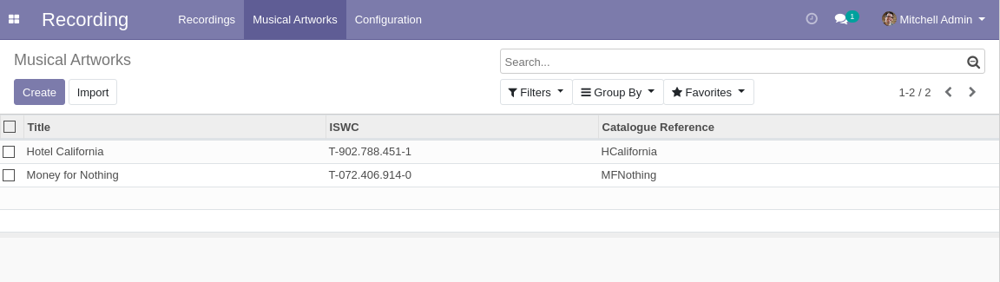
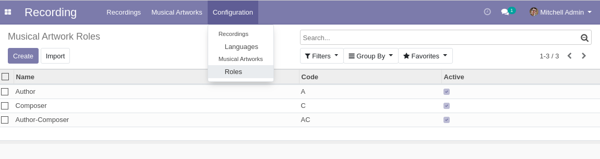
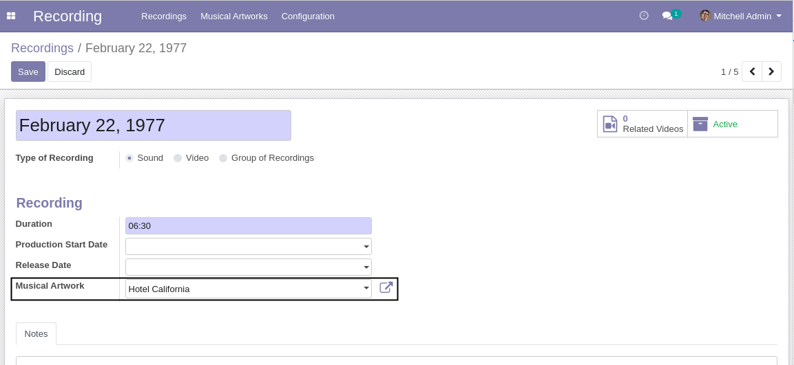
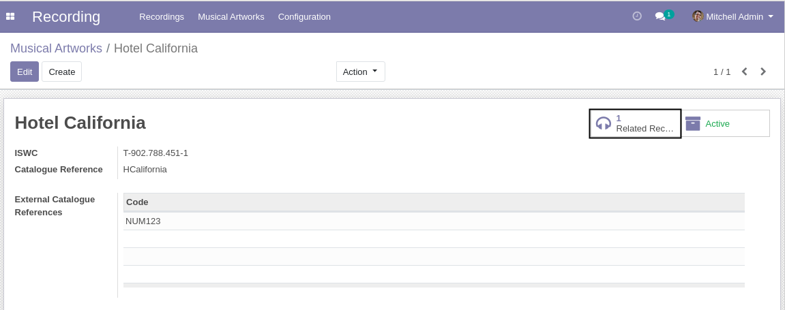

Recording Musical Artwork
=========================
This module is a binding between ``recording`` and ``musical_artwork``.

Musical Artworks
----------------
A menu entry is added for musical artworks.

Members of the group ``Recording / User`` have access to create / edit musical artworks.

Roles
-----
A menu entry is added for musical artwork roles.

Members of the group ``Recording / Manager`` have access to create / edit roles.

Recordings
----------
In the form view of a recording, a field is added to indicate the related musical artwork.

In the form view of a musical artwork, a smart button allows to view the list of related recordings.

Contributors
------------
* Numigi (tm) and all its contributors (https://bit.ly/numigiens)

More information
----------------
* Meet us at https://bit.ly/numigi-com
