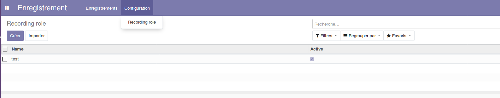

Recording Role
===================

This module allows to manage roles for the recording application.

Usage
-----

The configuration recording role menu item is available to members of the group ``Recording / Manager``
through the ``Recording / Configuration`` menu:

It shows the list of recording roles.

By clicking on a create button you can create a new recording role.

Contributors
------------
* Numigi (tm) and all its contributors (https://bit.ly/numigiens)
