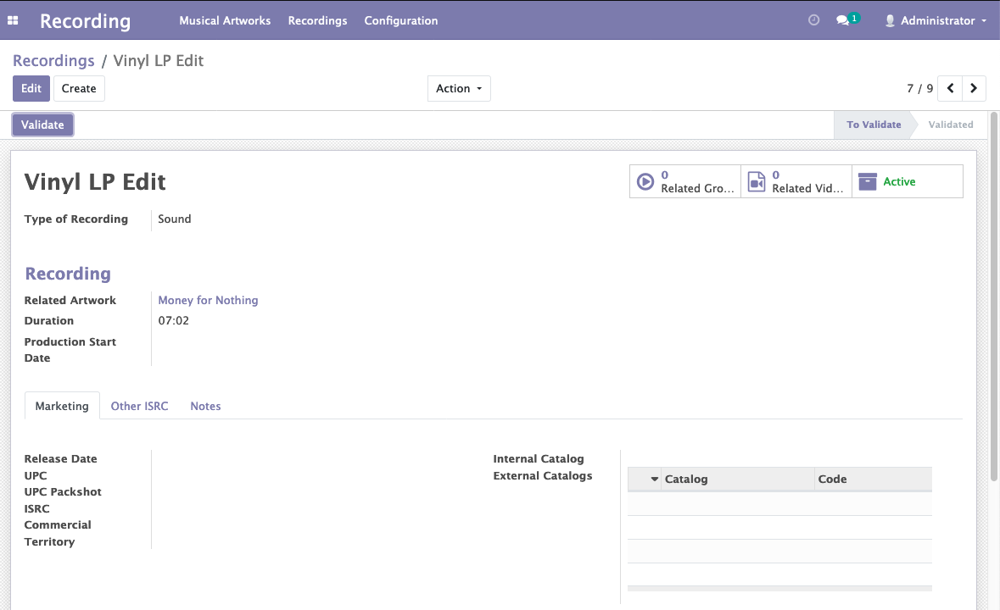

Recording Status
================

Description
-----------

This module adds a field Status to the records of the models Recording and
 Musical Artwork with the possible values "To validate" and "Validated".

Only users with the groups Recording/Manager can do the Validation of these records
 with a button "Validate".

When a validated record is updated by a user which is not a Recording/Manager,
 then the record status is switched back to "To validate".

Configuration
-------------

No configuration required apart from module installation.

Contributors
------------
* Numigi (tm) and all its contributors (https://bit.ly/numigiens)
* Komit (https://komit-consulting.com)

More information
----------------
* Meet us at https://bit.ly/numigi-com
