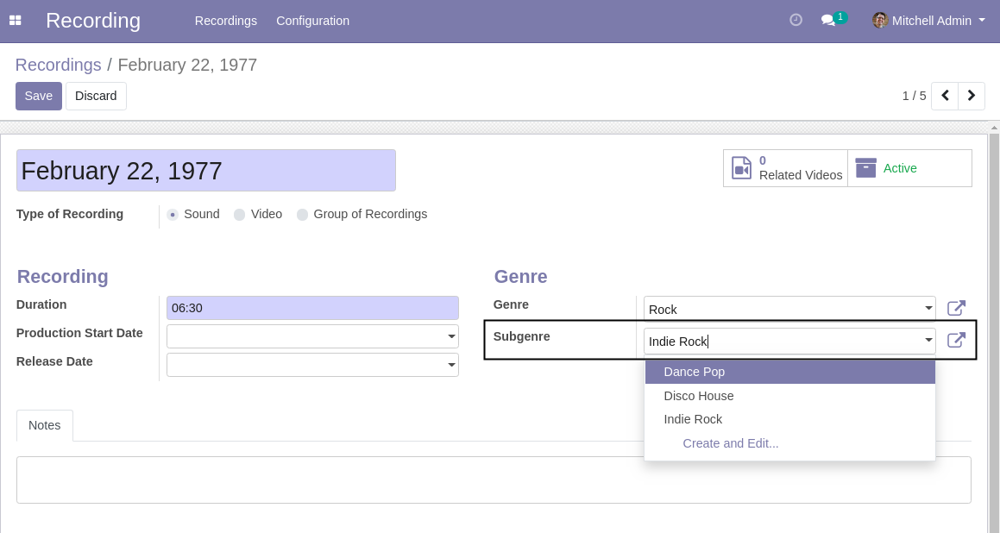

Recording Subgenres
===================

This module adds recording subgenres.

Usage
-----

The configuration subgenres menu item is available to members of the group ``Recording / Manager``
through the ``Recording / Configuration`` menu:

It shows the list of subgenres.

.. image:: static/description/subgenres.png

By clicking on a create button you can create a new subgenre of recording.

Recording
---------
On the form view of a recording, a field is added to select the subgenre of recording.

Contributors
------------
* Numigi (tm) and all its contributors (https://bit.ly/numigiens)
