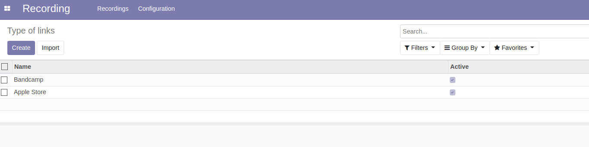

Recording Type of links
========================

This module allows to manage Type of links for the recording application.

Usage
-----

The configuration Type of links menu item is available to members of the group ``Recording / Manager``
through the ``Recording / Configuration`` menu:

It shows the list of Type of links.

By clicking on a create button you can create a new Type of links.

Contributors
------------
* Numigi (tm) and all its contributors (https://bit.ly/numigiens)
