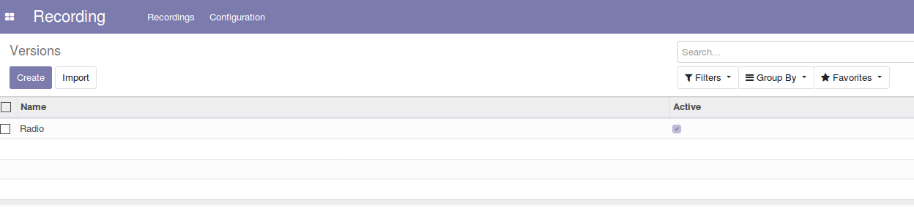
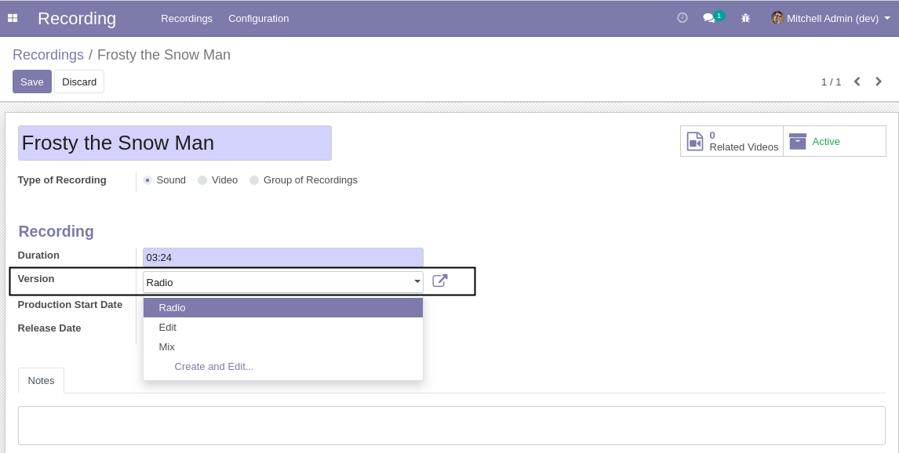

Recording Versions
==================

This module adds recording versions.

Usage
-----

The configuration versions menu item is available to members of the group ``Recording / Manager``
through the ``Recording / Configuration`` menu:

It shows the list of versions.

By clicking on a create button you can create a new version.

Recording
---------
On the form view of a recording, a field is added to select the version of the recording.

This field is only visible for recordings of type ``Sound`` and ``Group``.

Contributors
------------
* Numigi (tm) and all its contributors (https://bit.ly/numigiens)
