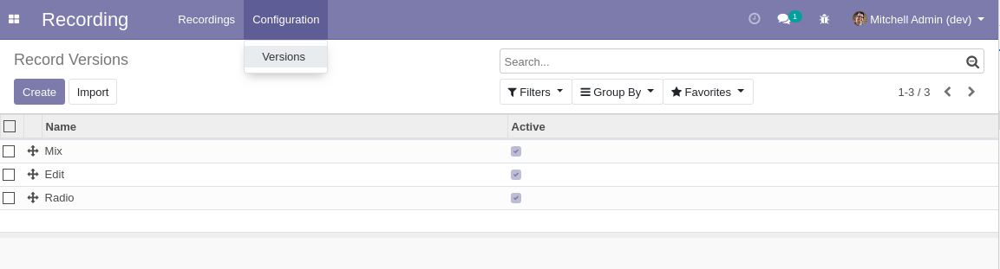

Recording Version
===================

This module allows to manage versions for the recording application.

Usage
-----

The configuration versions menu item is available to members of the group ``Recording / Manager``
through the ``Recording / Configuration`` menu:

It shows the list of versions.

By clicking on a create button you can create a new version.

Contributors
------------
* Numigi (tm) and all its contributors (https://bit.ly/numigiens)
