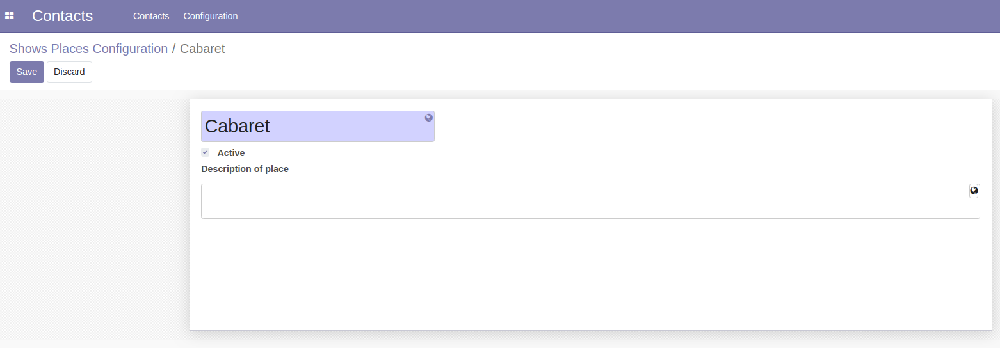

Shows Places Types/Configuration
=================================

This module allows to manage Shows Places Types/Configuration for the recording application.

Usage
-----

The Shows Places Types menu item is available to members of the group ``Sales / Manager``
through the ``Contacts / Configuration`` menu.

It shows the list of Shows Places Types.

.. image:: static/description/place_type_list.png

The Shows Places Configuration menu item is available to members of the group ``Sales / Manager``
through the ``Contacts / Configuration`` menu.

It shows the list of Shows Places Configuration.

.. image:: static/description/place_configuration_list.png

By clicking on a Place Configuration, the form view is opened.

This module also add a new type of partner ``Show site`` and a new page ``Show`` on partner form
visible only if type of partner is a ``Show site``.

.. image:: static/description/partner_show_form.png

Contributors
------------
* Numigi (tm) and all its contributors (https://bit.ly/numigiens)
