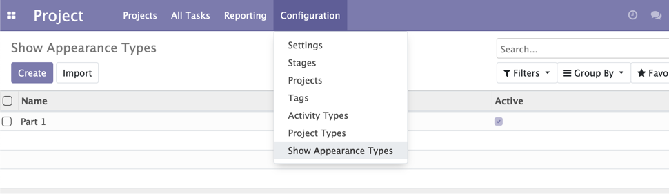
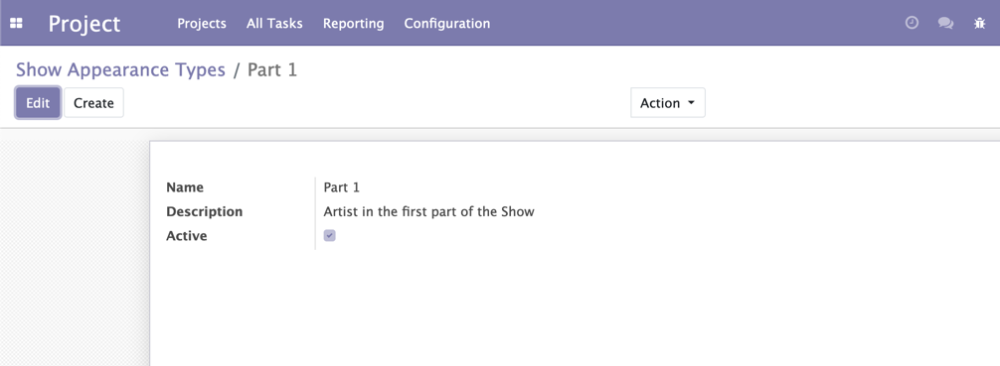
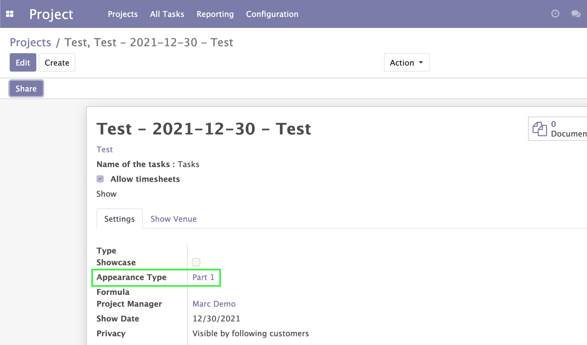

Show Appearance Type
=========================

Description
-----------

The Appearance Types menu item is available to members of the group ``Project / Manager``
through the ``Project / Configuration`` menu.

It shows the list of Appearance Types.

By clicking on a Appearance Types, the form view is opened.

On project form view, a new field Appearance Type is showed

Configuration
-------------

No configuration required apart from module installation.

Contributors
------------
* Numigi (tm) and all its contributors (https://bit.ly/numigiens)
* Komit (https://komit-consulting.com)

More information
----------------
* Meet us at https://bit.ly/numigi-com
