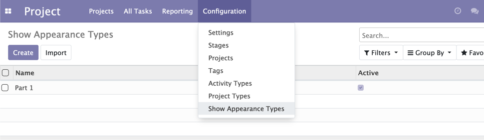
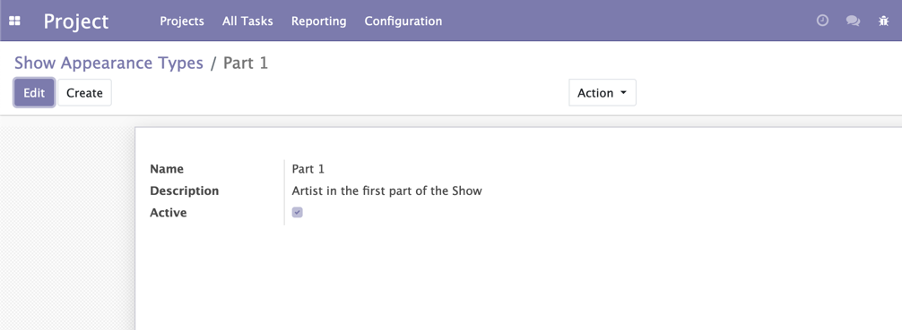
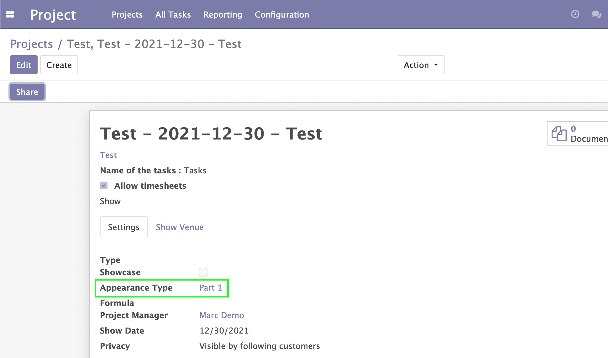

Show Appearance Type
=========================

Description
-----------

The Appearance Types menu item is available to members of the group ``Project / Manager``
through the ``Project / Configuration`` menu.

It shows the list of Appearance Types.

By clicking on a Appearance Types, the form view is opened.

On project form view, a new field Appearance Type is showed

Configuration
-------------

No configuration required apart from module installation.

Contributors
------------

The `Numigi <https://numigi.com/r/home>`_ team is the contributor to this project. We help Quebec companies implement Odoo and Konvergo ERP.
* Komit (https://komit-consulting.com)

