Show Place Types/Configuration
================================

This module allows to manage Show Place Types/Configuration.

.. contents:: Table of Contents

Configuration
-------------

Show Place Types
~~~~~~~~~~~~~~~~
The Show Place Types are available to members of the group ``Sales / Manager``
through the ``Contacts / Configuration`` menu.

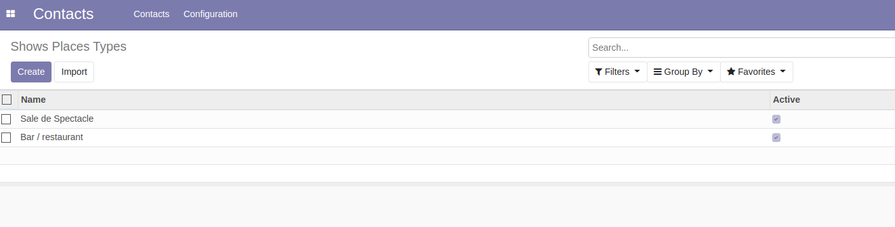

Show Place Configurations
~~~~~~~~~~~~~~~~~~~~~~~~~
The Show Place Configurations are available to members of the group ``Sales / Manager``
through the ``Contacts / Configuration`` menu.

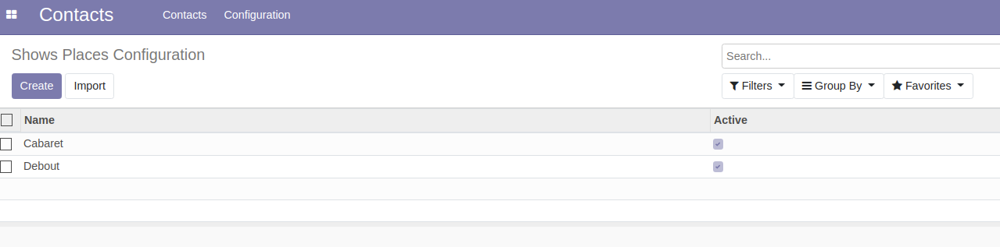

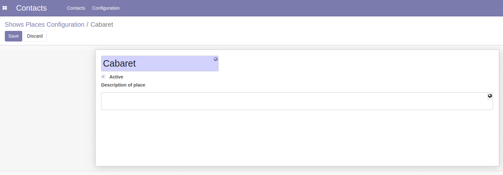

Diffuser Roles
~~~~~~~~~~~~~~
The Diffuser Roles are available to members of the group ``User types / Internal User``
through the ``Project / Configuration`` menu.

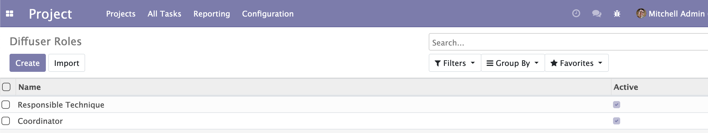

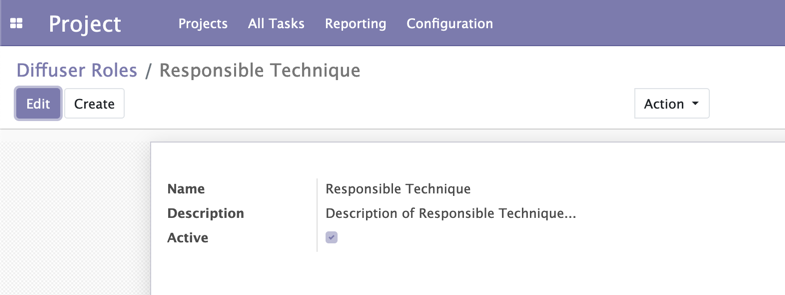

Usage
-----

Show Site
~~~~~~~~~
I create a new contact.

I notice a new type of contact ``Show Site``.

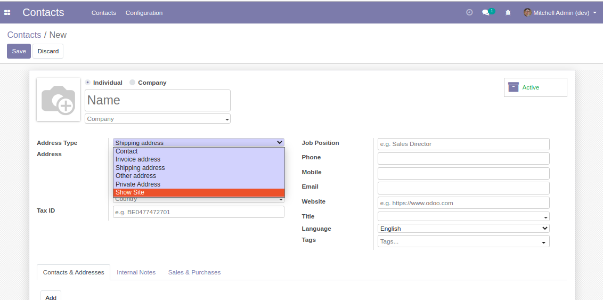

After selecting ``Show Site``, a new tab ``Show`` appears.

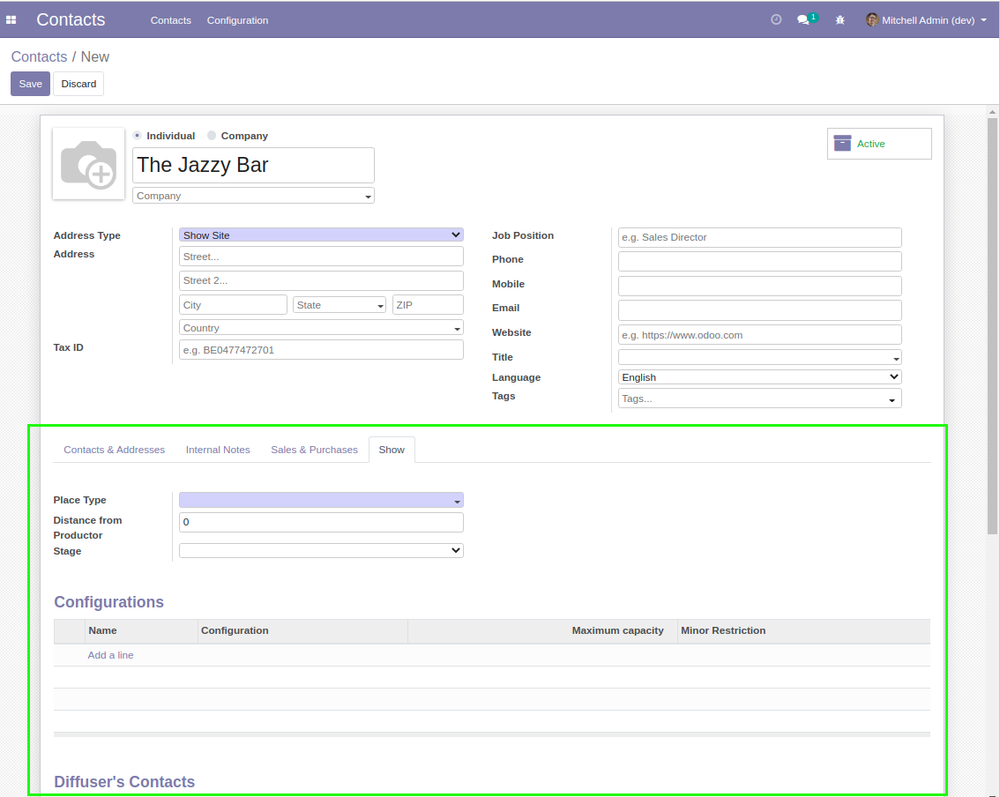

I select a type of place.

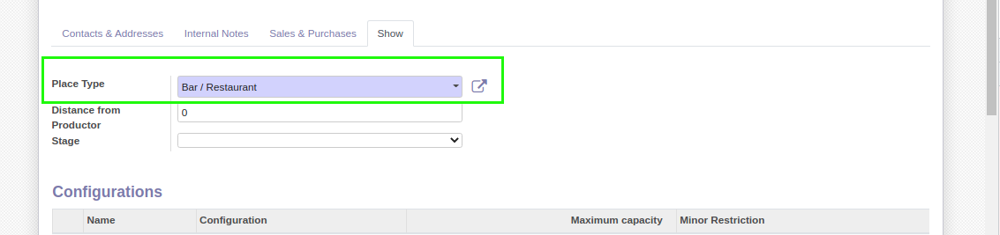

In the field ``Stage``, I can define whether the scene is indoor or outdoor.

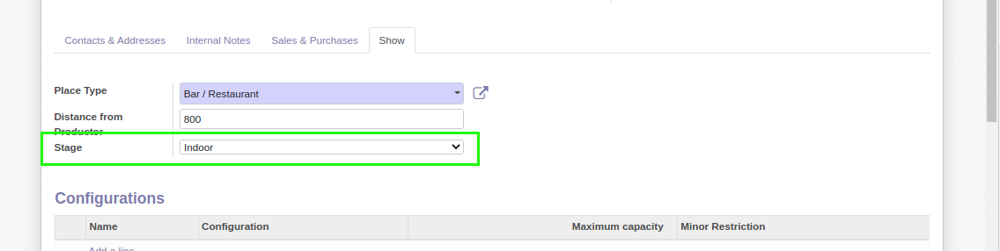

Configuration
~~~~~~~~~~~~~
Below in the same tab, I see a list of ``Configurations``.

It allows to define different possible configurations for the scene.

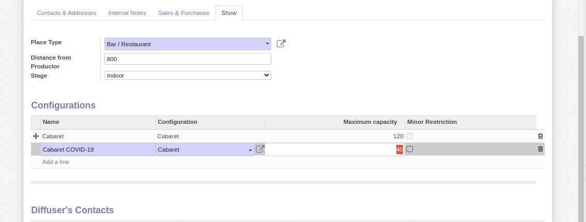

The ``Minor Restriction`` box allows to define whether this configuration is restricted to minors.

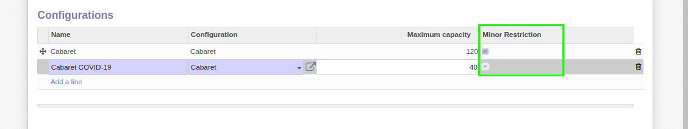

Diffusers
~~~~~~~~~
Below in the same tab, I see a list of ``Diffuser's Contacts``.

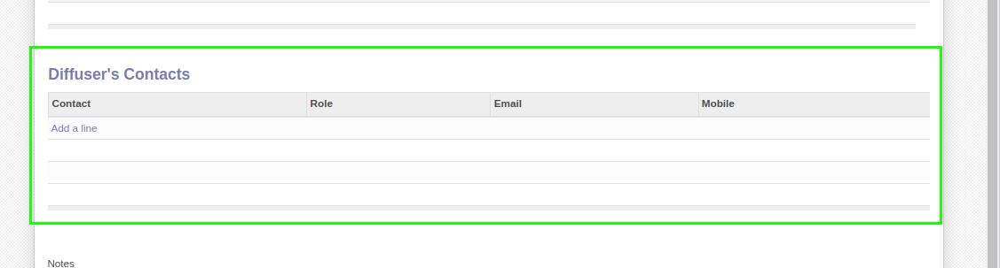

When selecting a contact, the email and mobile numbers are filled.

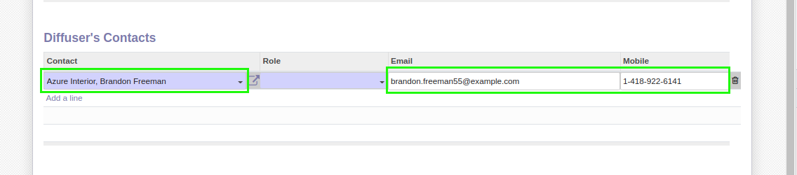

I select a role for this contact.

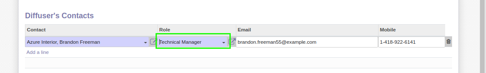

Contributors
------------
* Numigi (tm) and all its contributors (https://bit.ly/numigiens)
