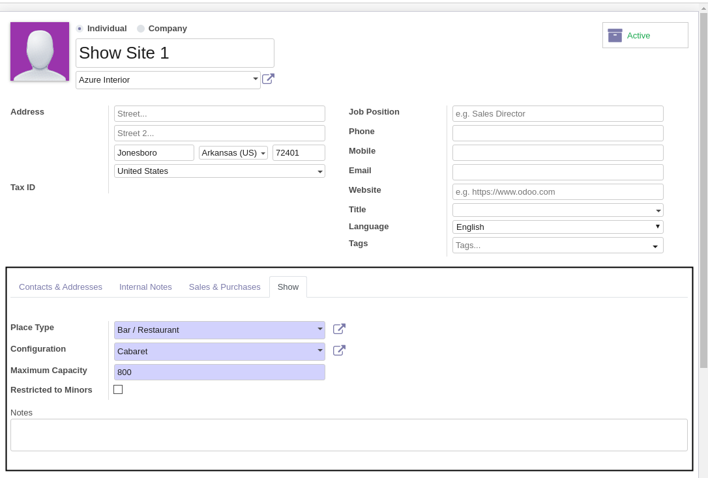

Show Place Types/Configuration
================================

This module allows to manage Show Place Types/Configuration.

Usage
-----

The Show Place Types menu item is available to members of the group ``Sales / Manager``
through the ``Contacts / Configuration`` menu.

It shows the list of Show Place Types.

.. image:: static/description/place_type_list.png

The Show Place Configuration menu item is available to members of the group ``Sales / Manager``
through the ``Contacts / Configuration`` menu.

It shows the list of Show Place Configuration.

.. image:: static/description/place_configuration_list.png

By clicking on a Place Configuration, the form view is opened.

.. image:: static/description/place_configuration_form.png

This module also add a new type of partner ``Show Site`` and a new page ``Show`` on partner form
visible only if type of partner is a ``Show Site``.

Contributors
------------
* Numigi (tm) and all its contributors (https://bit.ly/numigiens)
