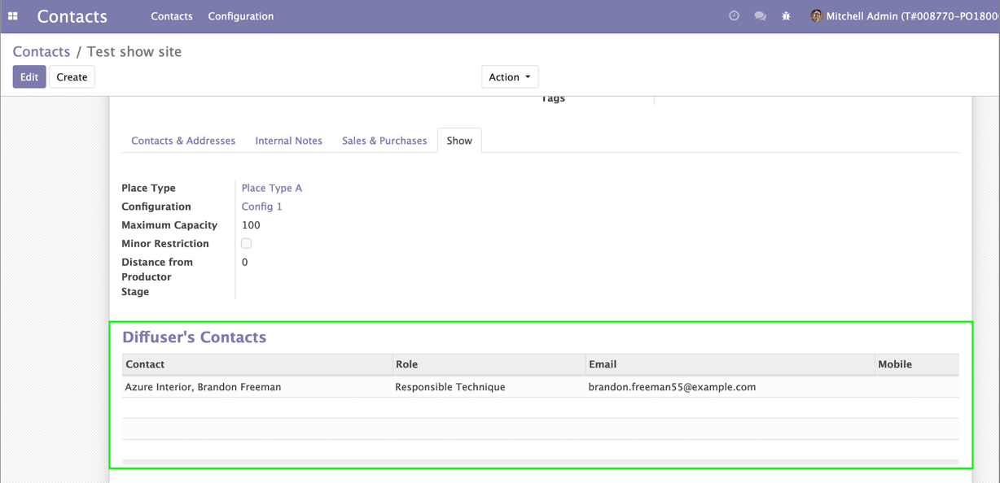

Show Place Types/Configuration
================================

This module allows to manage Show Place Types/Configuration.

Usage
-----

The Show Place Types menu item is available to members of the group ``Sales / Manager``
through the ``Contacts / Configuration`` menu.

It shows the list of Show Place Types.

.. image:: static/description/place_type_list.png

The Show Place Configuration menu item is available to members of the group ``Sales / Manager``
through the ``Contacts / Configuration`` menu.

It shows the list of Show Place Configuration.

.. image:: static/description/place_configuration_list.png

By clicking on a Place Configuration, the form view is opened.

.. image:: static/description/place_configuration_form.png

This module also add a new type of partner ``Show Site`` and a new page ``Show`` on partner form
visible only if type of partner is a ``Show Site``.

.. image:: static/description/partner_show_form.png

The Diffuser Roles menu item is available to members of the group ``User types / Internal User``
through the ``Project / Configuration`` menu.

It shows the list of Diffuser Roles.

.. image:: static/description/diffuser_role_list.png

By clicking on a Diffuser Role, the form view is opened.

.. image:: static/description/diffuser_role_form.png

On partner form, on new page ``Show``, an new table ``Diffuser's Contacts`` is showed.

As a person who can manage contact, I can add a new Diffuser's Contact.

When selecting a Contact, I see that Email and Mobile is automatically filled by selected
Contact's Email and Mobile and remain editable

Contributors
------------
* Numigi (tm) and all its contributors (https://bit.ly/numigiens)
