Show Project
============

.. contents:: Table of Contents

Context
-------
The module `project_iteration <https://github.com/Numigi/odoo-project-addons/tree/12.0/project_iteration>`_
defines the concept of a parent and a child project (a.k.a. the iteration).

The module `show_place <https://github.com/Numigi/odoo-entertainment-addons/tree/12.0/show_place>`_ allows to create contacts of type ``Show Site``.

Description
-----------
This module allows to use the ``Projects`` application to manage musical shows and tours.

Tours are represented as parent projects and shows are represented as children (iterations) of a tour.

Usage
-----
I open the form view of a project in creation mode.

I notice a new selection field.
It allows to define the project as either, a tour, a show or a standard project.

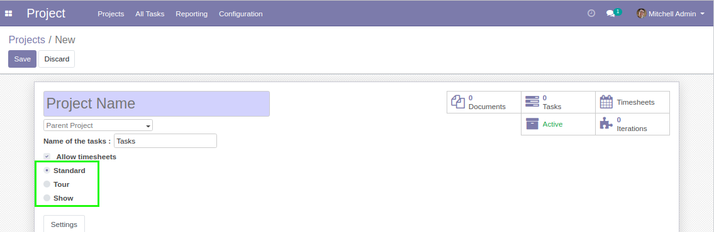

Tour
~~~~
First, I create a project of type ``Tour``.

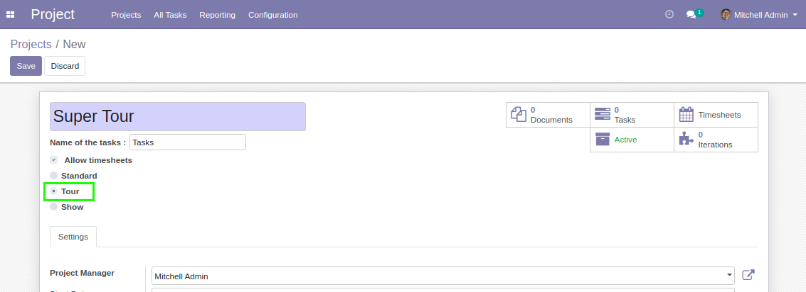

On a project of type ``Tour``, I can not select a parent project.

Show
~~~~
I create a project of type ``Show``.

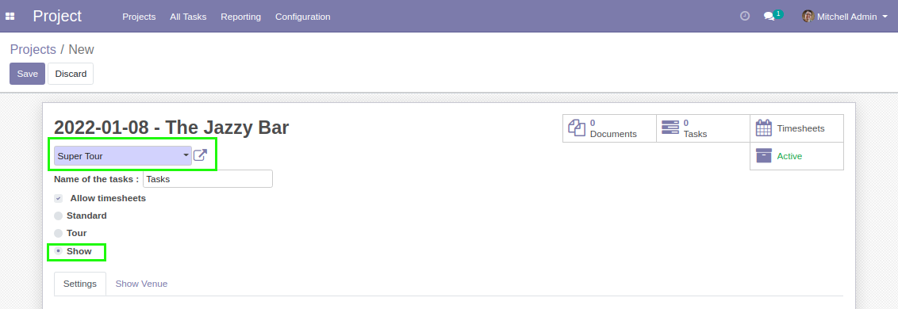

On a project of type ``Show``, the field ``Parent`` is mandatory.
You may only select a parent project of type ``Tour``.

You must select a ``Show Date``.

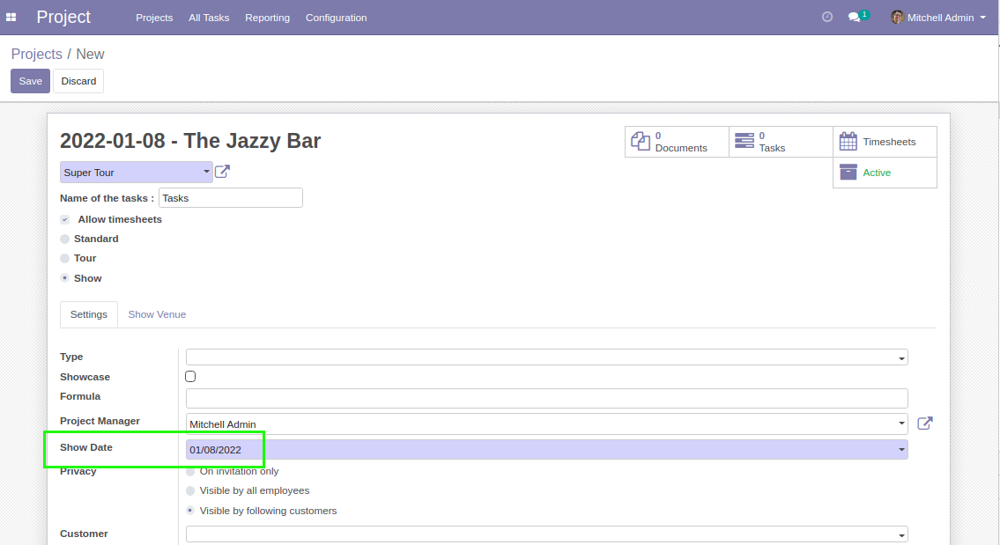

You must also select a ``Venue``.

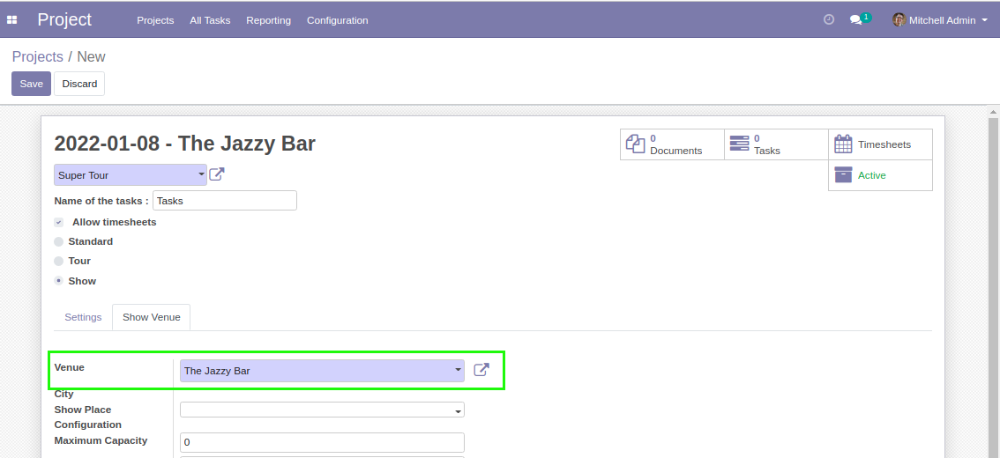

The venue is the place where the show is performed.
You may only select a partner of type ``Show Site``.

The name of the project is readonly.
It is computed based on the show date and venue.

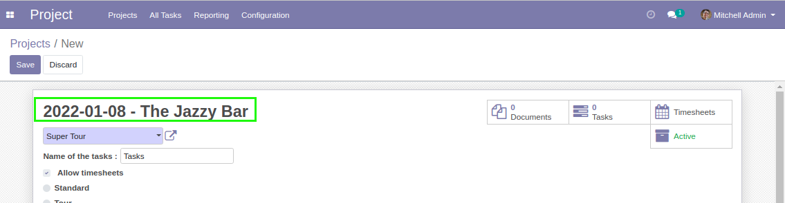

When you select a parent project ``Tour``, the fields ``Artist``
and ``Analytic Account`` are automatically filled with the
values of the fields ``Artist`` and ``Analytic Account``
of the parent project ``Tour`` respectively.

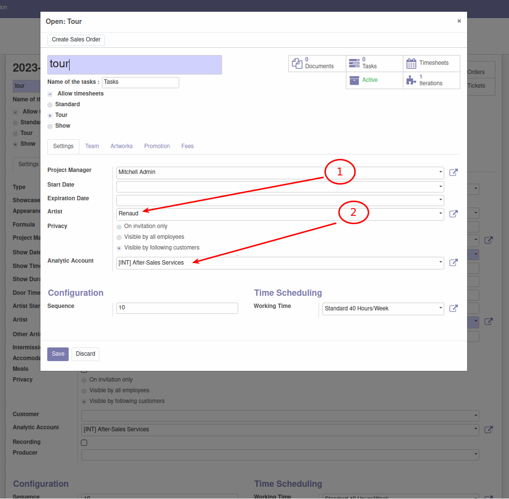

The project of type ``Show``.

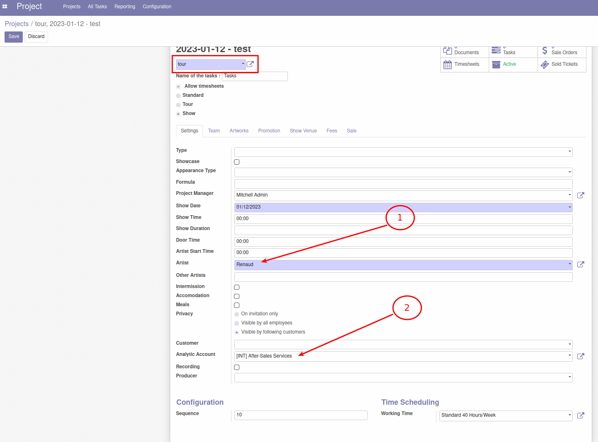

The analytic account/customer constraint is deleted
in case of project type ``Show`` or ``Tour``.

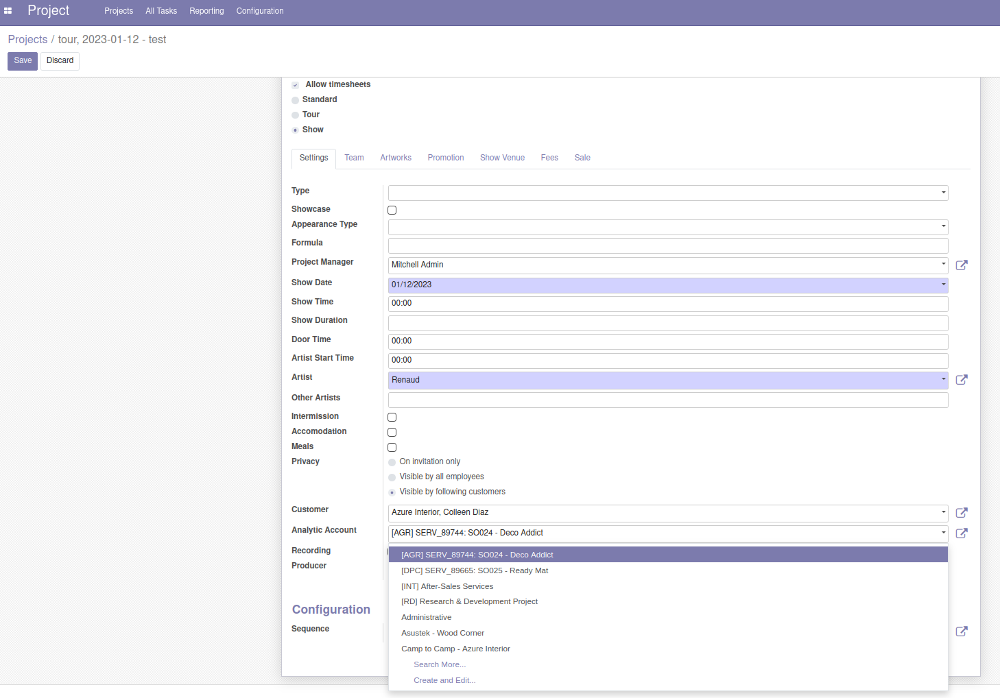

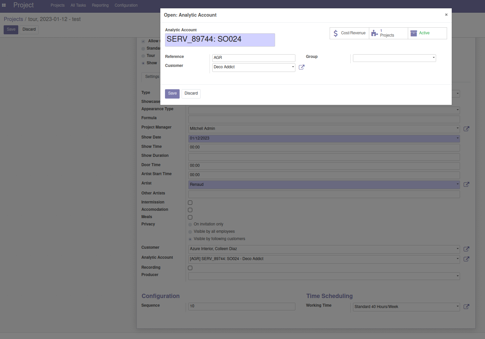

Show Configuration
~~~~~~~~~~~~~~~~~~
In the ``Venue`` tab, the field ``Configuration`` allows to select a site configuration for this show.

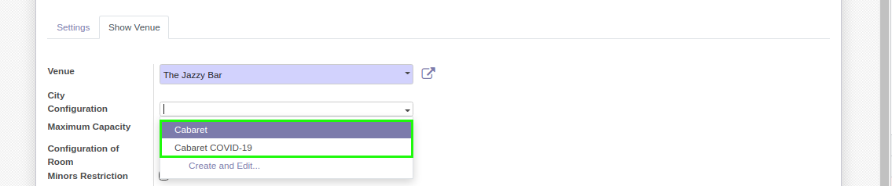

The available values are the predefined on the venue.

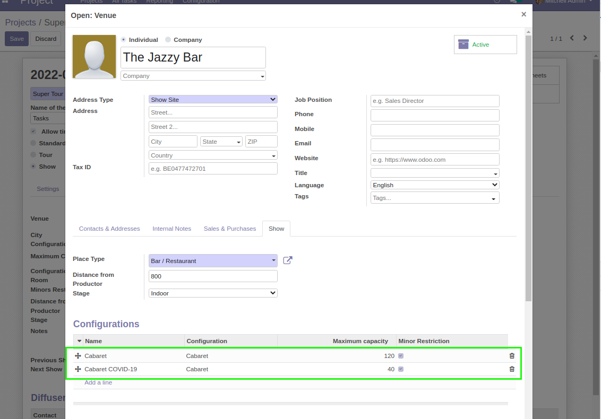

After selecting a configuration, I notice that the fields below were automatically filled.

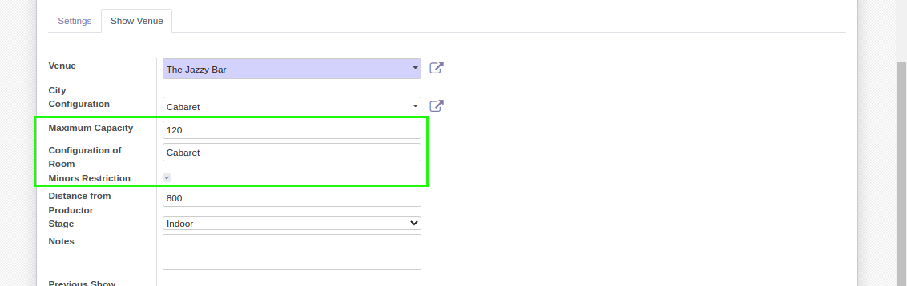

Other fields are populated based on values defined on the show venue.

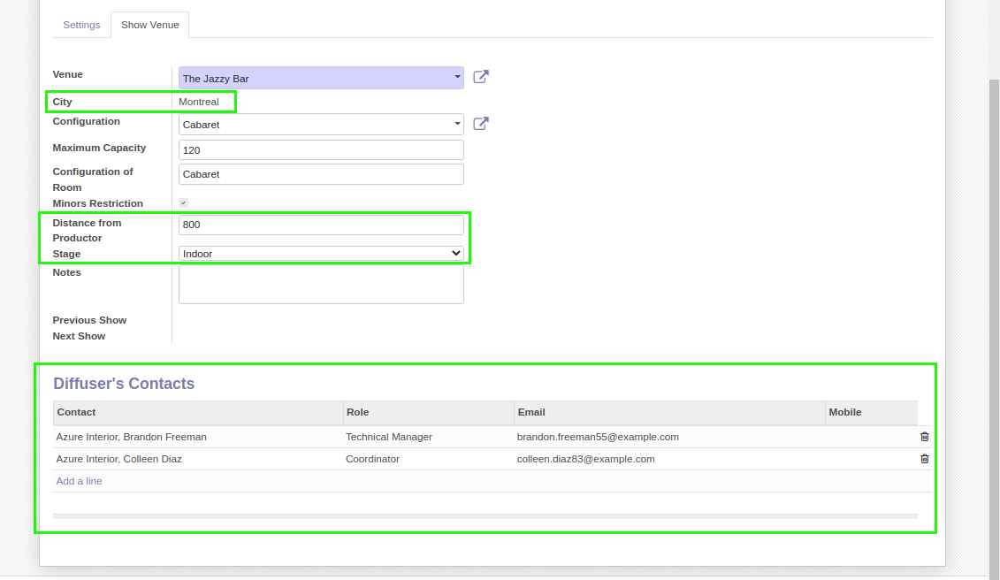

Show/Tour Project Search view
~~~~~~~~~~~~~~~~~~~~~~~~~~~~~
Since version ``2.0.4`` of the module, when I access the ``Project`` application, I can search by ``Artist`` and ``City`` from the search bar.

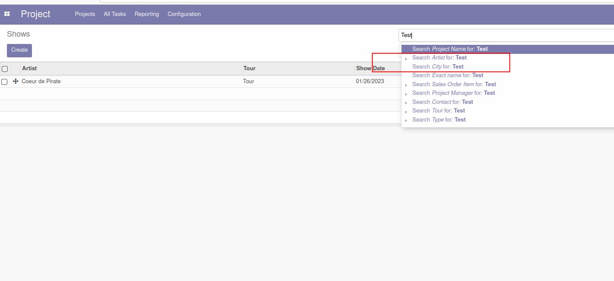

* Numigi (tm) and all its contributors (https://bit.ly/numigiens)
* Komit (https://komit-consulting.com)

More information
----------------
* Meet us at https://bit.ly/numigi-com
