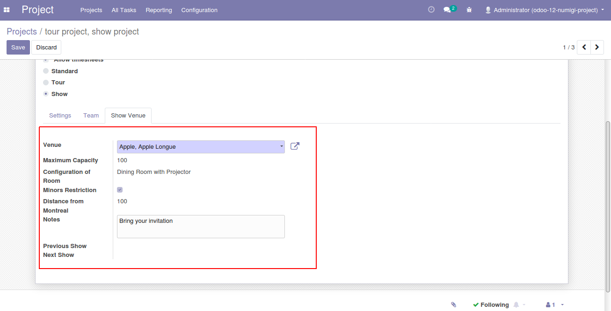

Show Project
============

Description
-----------

This module adds a field Show Type and Formula to the records of the model Project.
Show Type has the possible values "Standard", "Tour" and "Show".
Formula is only shown when Show Type has "Tour" value in Settings Tab

In security, Project - Show Manager Group is created to grant access for user on tour and show project type

.. image:: static/description/project_screenshot.png

User can define a list of project members for tour or show project in the **Team** tab

.. image:: static/description/project_show_member.png

For show project, user can see the new **Show** tab

Configuration
-------------

No configuration required apart from module installation.

Contributors
------------
* Numigi (tm) and all its contributors (https://bit.ly/numigiens)
* Komit (https://komit-consulting.com)

More information
----------------
* Meet us at https://bit.ly/numigi-com
