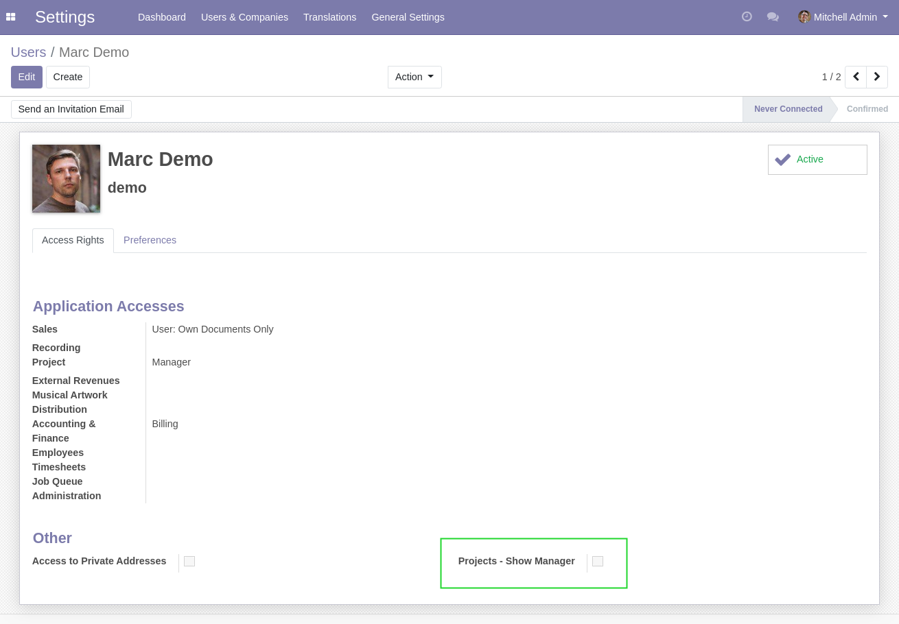
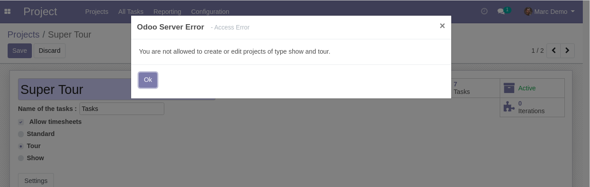
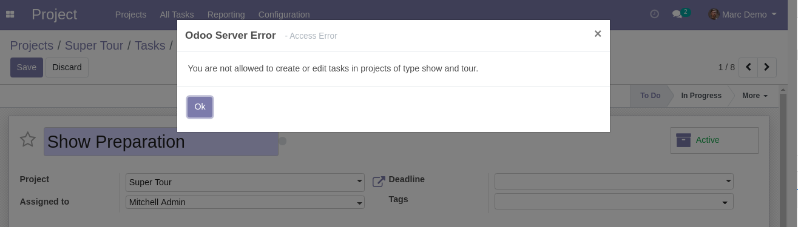

Show Project Access Specific
============================
This module adds access rules to the ``Projects`` app, in the context of show tours.

.. contents:: Table of Contents

Show Project Group
------------------
A new group of users ``Show Management`` is added:

Only members of this group are able to edit or create projects ``Show`` and ``Tour``.
The same logic applies to tasks under these projects.

However, other security rules on edition of projects and tasks still apply.
In other words, the group ``Show Management`` does not grant any permission. It restricts write access to non-members.

Usage
-----
As non member of the group ``Show Management``, I modify a project of type ``Show``.

A blocking message is displayed.

A similar message is displayed when I try to modify a task under the project.

Contributors
------------
* Numigi (tm) and all its contributors (https://bit.ly/numigiens)

More information
----------------
* Meet us at https://bit.ly/numigi-com
