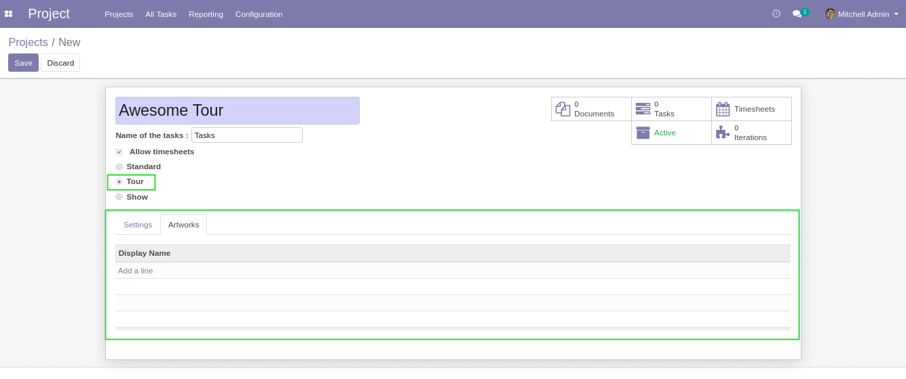
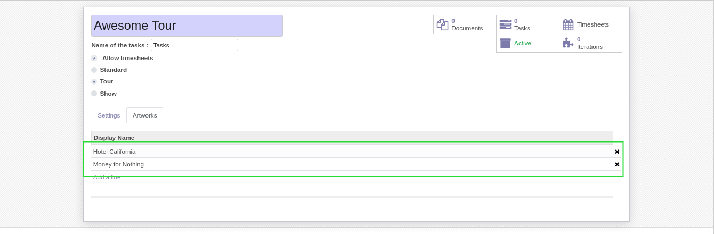
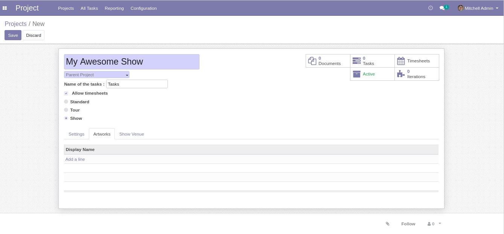
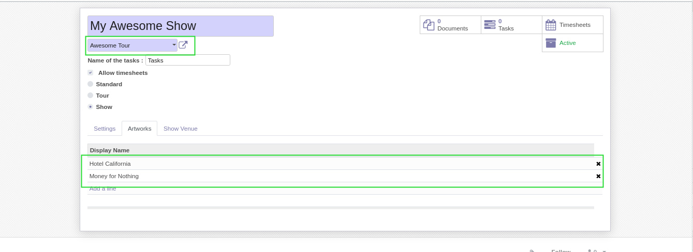
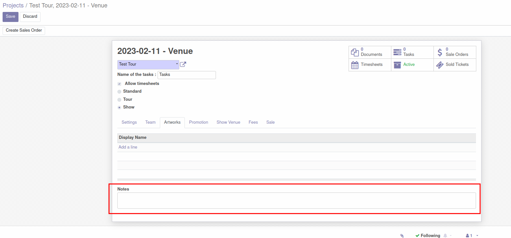

Show Project Artwork
====================

This module adds a tab of projects.

This tab allows to link ``Musical Artworks`` to projects.

Tour Projects
-------------
I go to the form view of a project of type ``Tour``.

I notice a new tab ``Artworks``.

I can link artworks to the project.

Show Projects
-------------
I create a new project of type ``Show`` and select a tour as parent.

I notice that the artworks were propagated from the parent tour.

I can optionnaly add or remove artworks from the show.

New field **Notes** is created in "Artworks" tab.

Contributors
------------
* Numigi (tm) and all its contributors (https://bit.ly/numigiens)

More information
----------------
* Meet us at https://bit.ly/numigi-com
