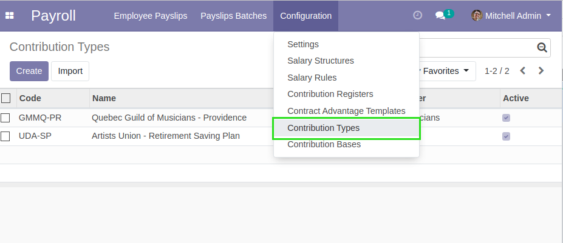
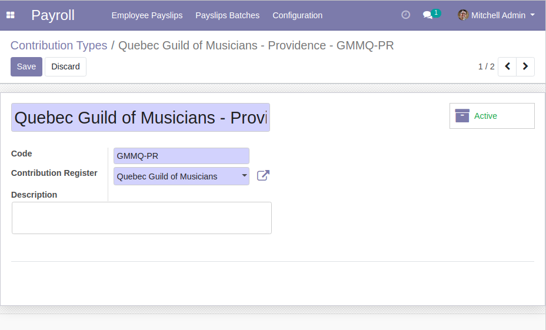
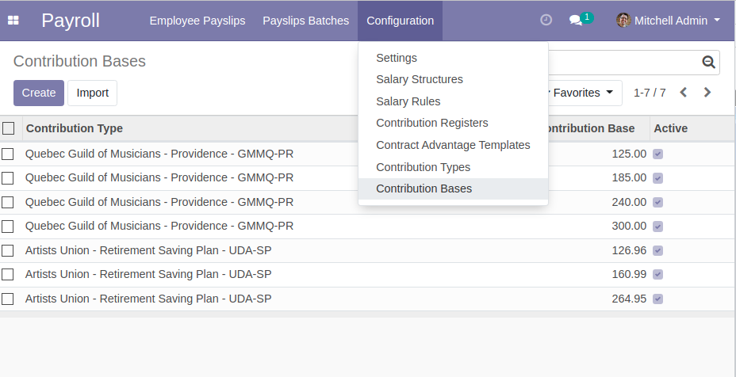
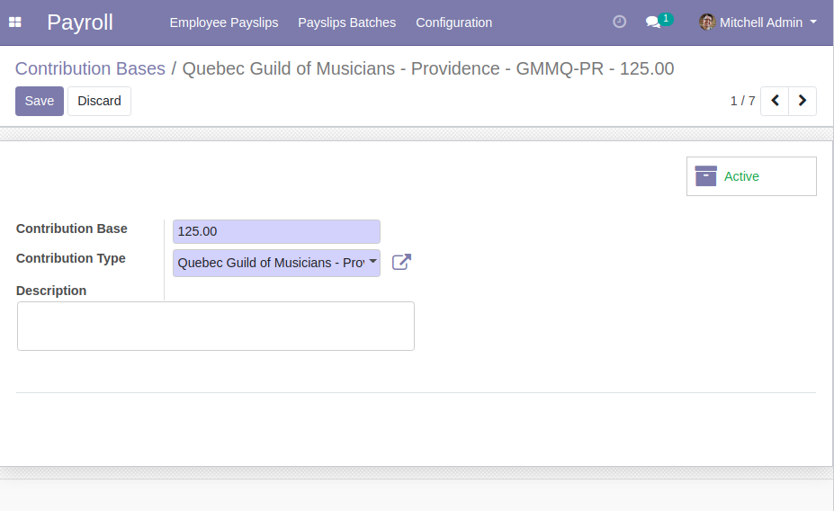
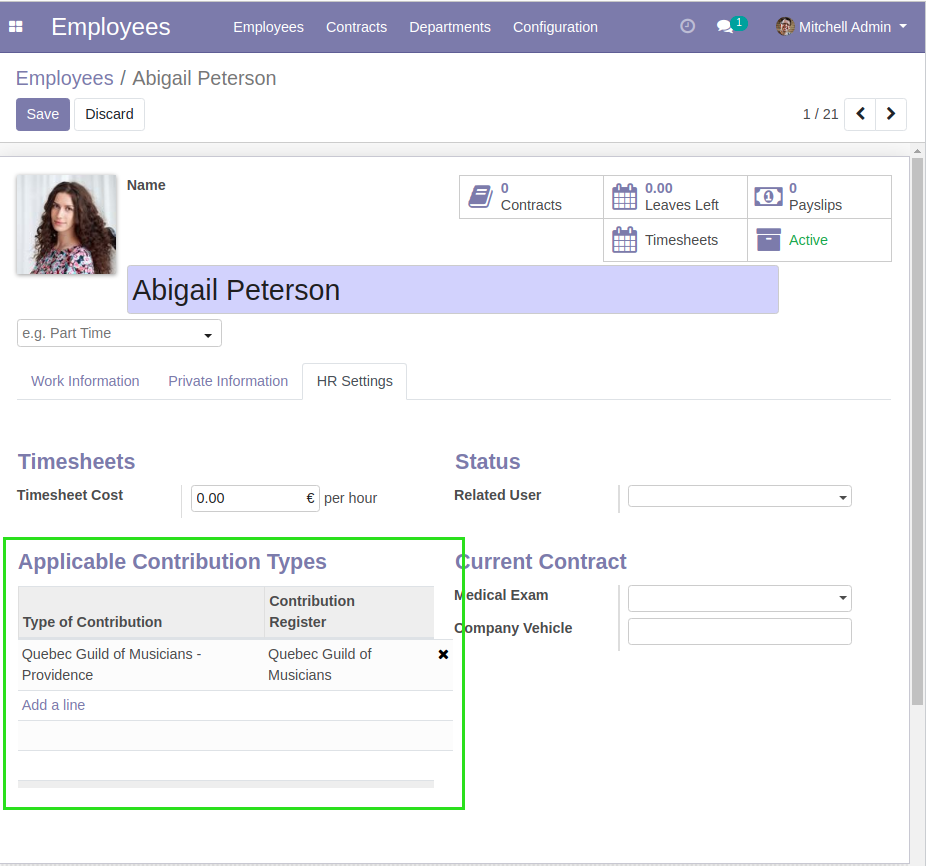
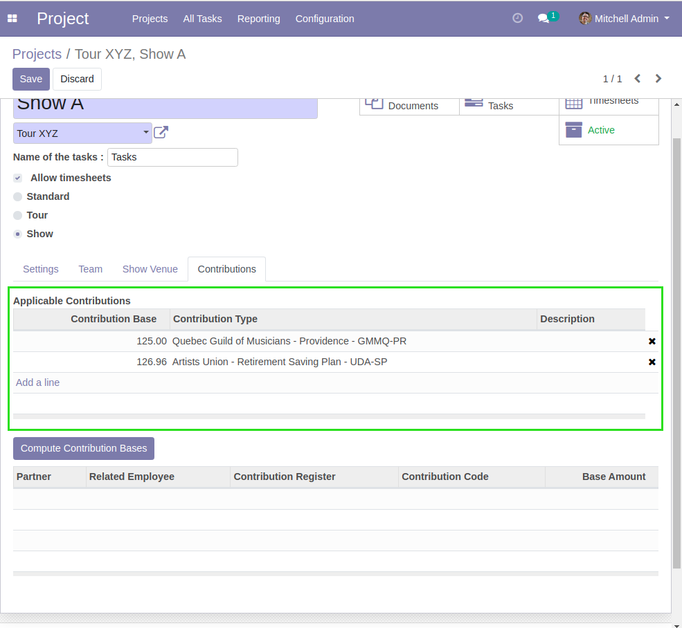
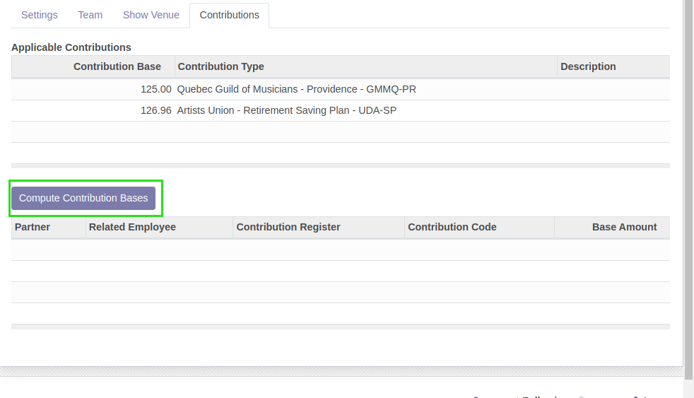
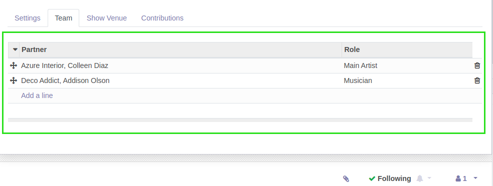
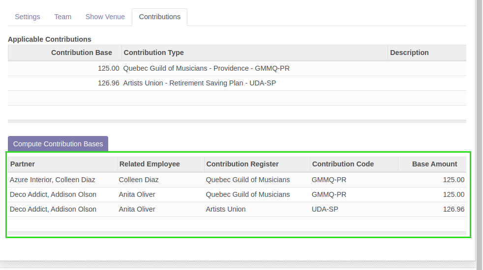
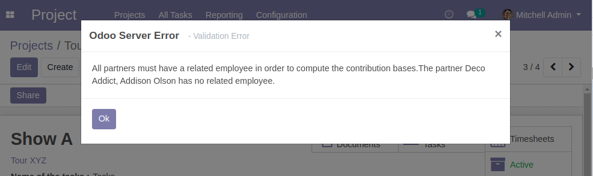

Show Project Contribution
=========================
This module allows to define employee payroll contributions on shows.

Configuration
-------------
As ``Payroll / Manager``, under ``Payroll / Configuration / Contribution Types``,
I find the list of contribution types.

Under ``Payroll / Configuration / Contribution Bases``, I find the list of contribution bases.

As ``Human Resources / Manager``, I can define applicable contribution types for an employee.

Usage
-----
In the form view of a project of type ``Show``, I can define applicable contribution bases.

..

	It is not possible to select multiple contribution bases of the same type.

Then, I click on ``Compute Contribution Bases``.

Based on the team members of this show, the list of contributions is computed.

How Contributions Are Computed
~~~~~~~~~~~~~~~~~~~~~~~~~~~~~~
For each applicable contribution defined on the show, if the contribution type is defined on
the employee related to a member of the team, this contribution is applied for this member.

The relation between the partner and the employee is done through the field ``Work Address``.

.. image:: static/description/employee_work_address.png

If a member has no related employee, an error message is displayed.

Contributors
------------
* Numigi (tm) and all its contributors (https://bit.ly/numigiens)

More information
----------------
* Meet us at https://bit.ly/numigi-com
