Show Project Fee
================

This module allows to manage ``Fees`` on tours and shows.

Tour Projects
-------------
I go to the form view of a project of type ``Tour``.

I notice a new tab ``Fees``.

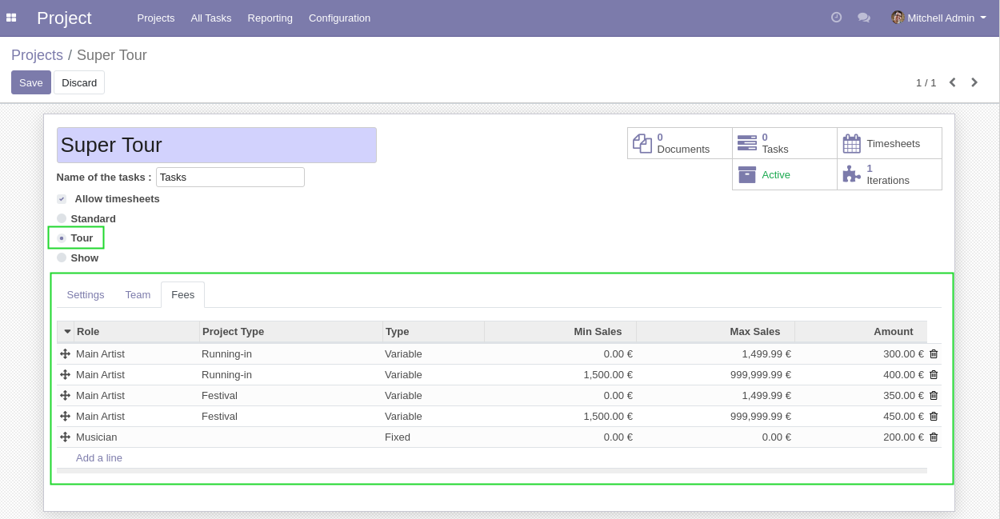

This tab contains the configuration of fees for this tour.
Every show in this tour will compute fees based on this configuration.

Member Role
~~~~~~~~~~~
A fee distributed to an artist depends on the ``role`` of the artist.
For example, the fee for the main artist can be different from the fee for other musicians.

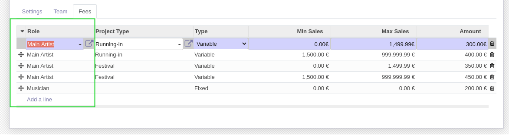

Project Type
~~~~~~~~~~~~
The fees depend on the type of project defined on the show.

In the context of shows, a project type represents the phase of a show.

For example, the fees for a running-in of a show can be different from the fees for the regular show
or when playing in a festival.

.. image:: static/description/tour_fees_project_type.png

If no project type is given, the fee is applied for all show phases.

Sales Range
~~~~~~~~~~~
It is also possible to apply the fees only if the ticket sales are between a given range.

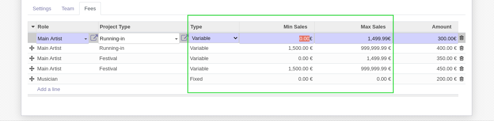

A ``Fixed`` amount means that the amount of fee does not change based on ticket sales.

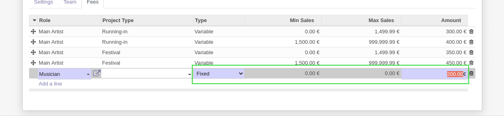

Show Projects
-------------
I create a new project of type ``Show`` and select a tour as parent.

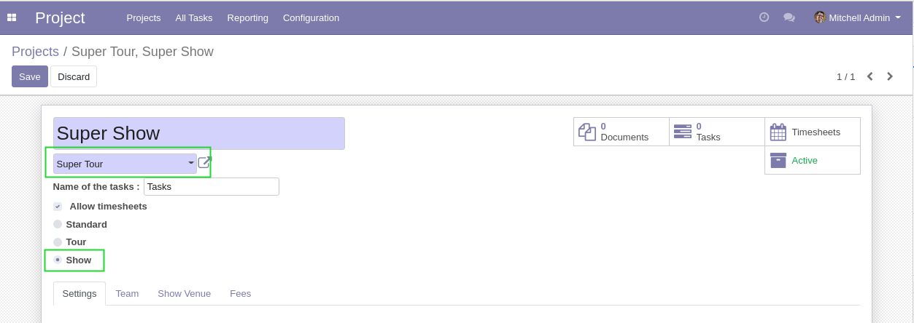

I select a type of project.

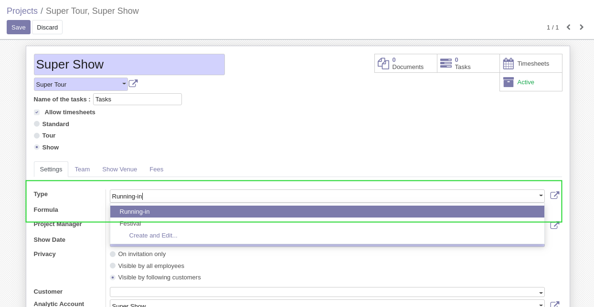

In the ``Team`` tab, I select the members of this show.

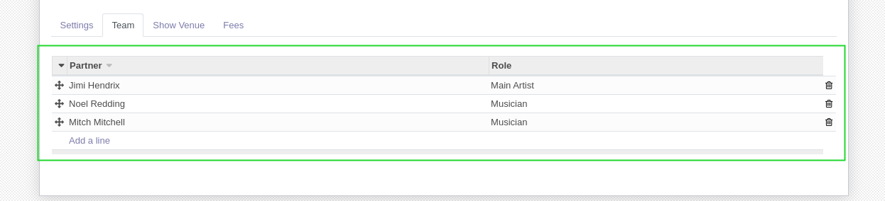

I go to the ``Fees`` tab.

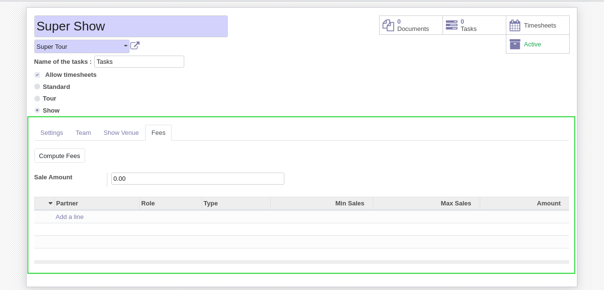

I enter an amount of ticket sales, then I click on ``Compute Fees``.

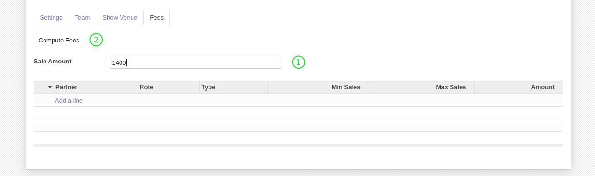

The fees for this show are computed.

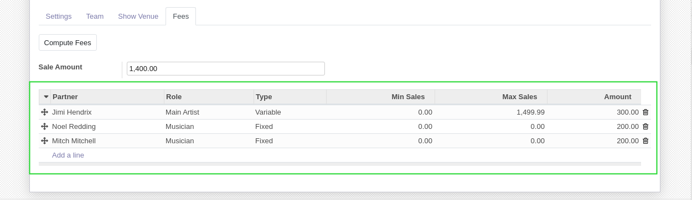

New field **Notes** is created in "Fees" tab.

.. image:: static/description/notes_fee_page.png

Since version ``1.1.1`` of the module, "sale amount" field is moved before "Variable Income" group.

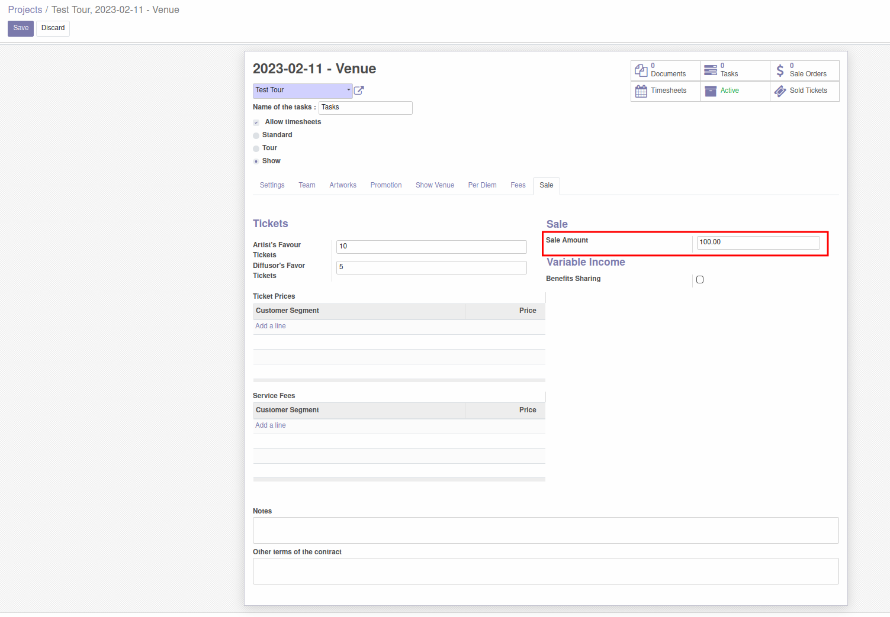

Contributors
------------
* Numigi (tm) and all its contributors (https://bit.ly/numigiens)

More information
----------------
* Meet us at https://bit.ly/numigi-com
