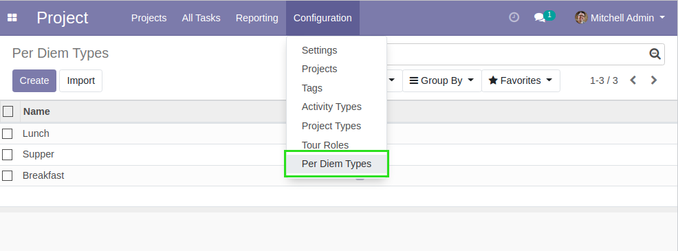
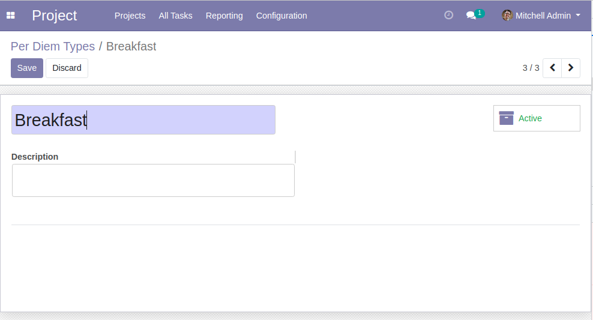
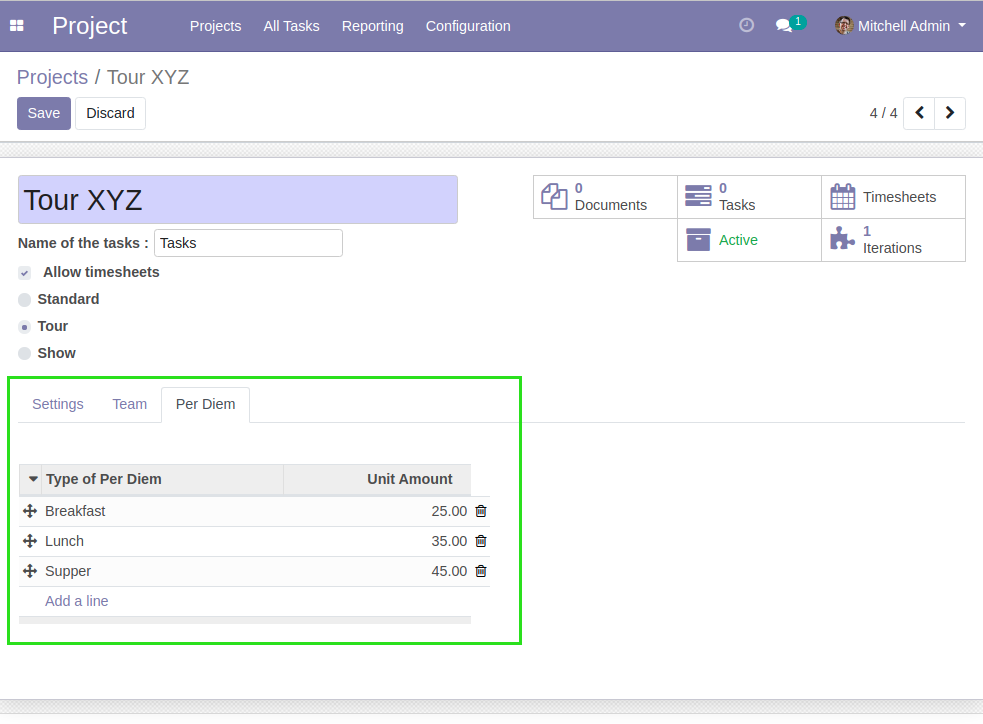
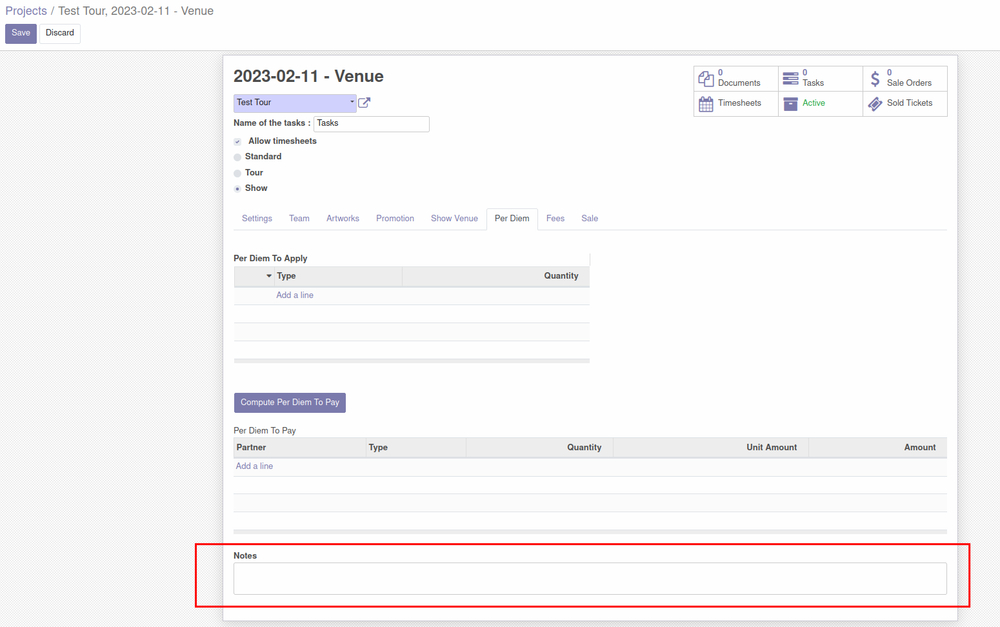
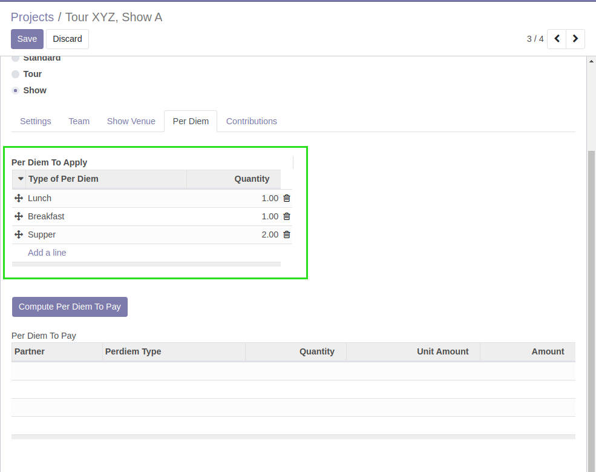
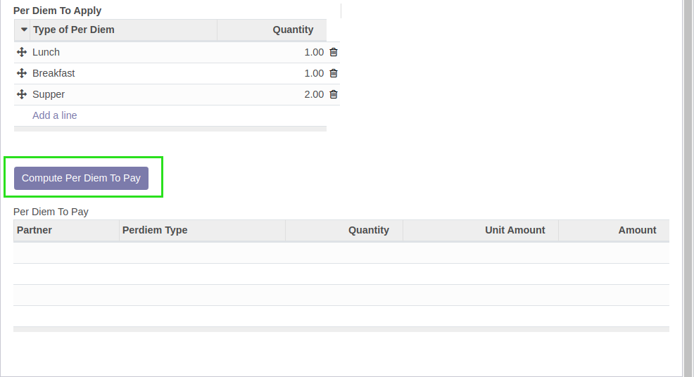
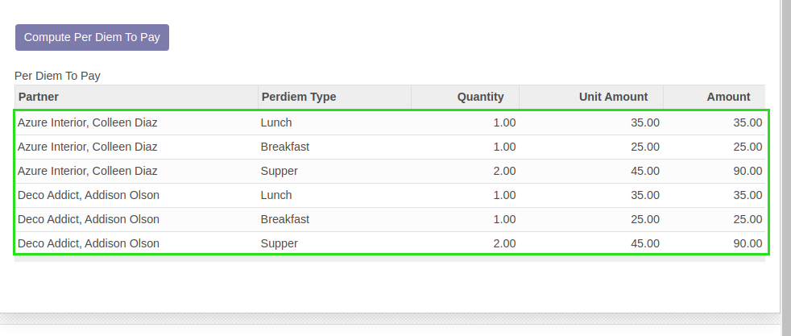
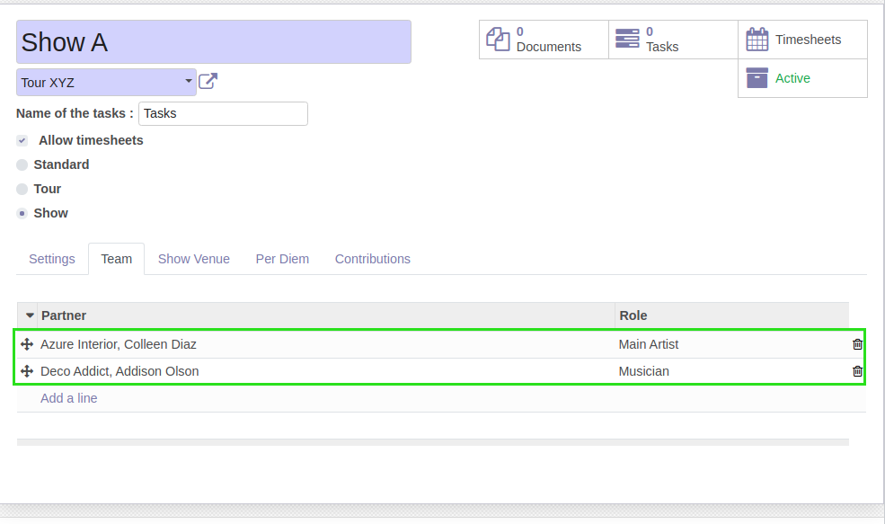

Show Project Per Diem
=====================
This module allows to define ``Per Diem`` on shows.

.. contents:: Table of Contents

Configuration
-------------
As ``Project / Manager``, under ``Project / Configuration / Per Diem Types``,
I find the list of per diem types.

Tour Configuration
------------------
As ``Project / Manager``, I go to a project of type ``Tour``.

I notice a new tab ``Per Diem`` containing a table.

This table allows to define unit amounts to pay for a given type of per diem.

..

    It is not possible to define multiple lines with the same per diem type.

New field **Notes** is created in "Per Diem" tab.

Usage
-----
As ``Project / Manager``, I go to a project of type ``Show``.

In the tab ``Per Diem``, I notice a table ``Per Diem To Apply``.

This table allows to define quantities of each type of per diem that are applicable
for this show.

..

    It is not possible to define multiple lines with the same per diem type.

I click on the button ``Compute Per Diem To Pay``.

The table below is filled with lines of per diem to pay, based on the quantities
defined on the show and the unit amounts defined on the tour.

Each per diem is applicable for every member of the show.

Contributors
------------
* Numigi (tm) and all its contributors (https://bit.ly/numigiens)

More information
----------------
* Meet us at https://bit.ly/numigi-com
