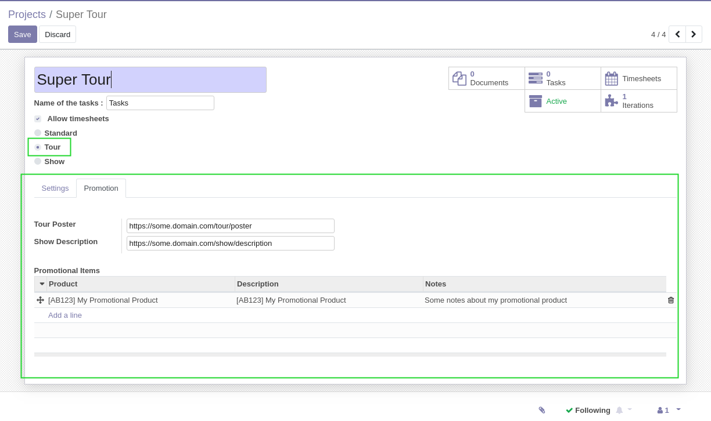
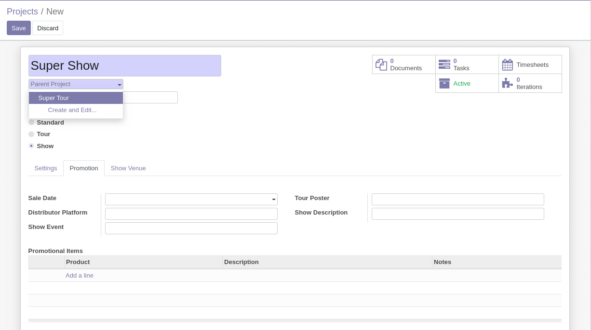
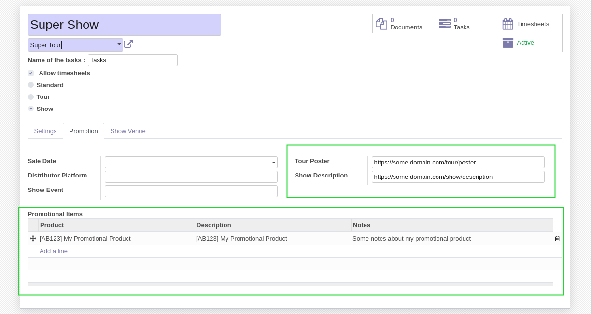
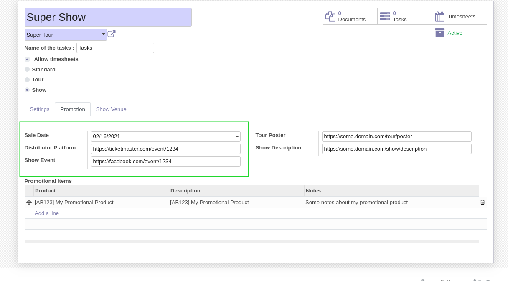

Show Project Promotion
======================

This module adds a ``Promotion`` tab to projects.

Tour Projects
-------------
I go to the form view of a project of type ``Tour``.

I notice a new tab ``Promotion``.

This tab contains the info related to the promotion of a show, including a list of promotional products.

Show Projects
-------------
I create a new project of type ``Show`` and select a tour as parent.

I notice that the promotional information was propagated from the parent tour.

Also, a few extra fields are available for the show.

Contributors
------------
* Numigi (tm) and all its contributors (https://bit.ly/numigiens)

More information
----------------
* Meet us at https://bit.ly/numigi-com
