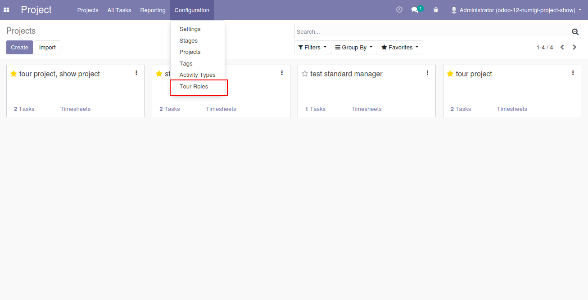
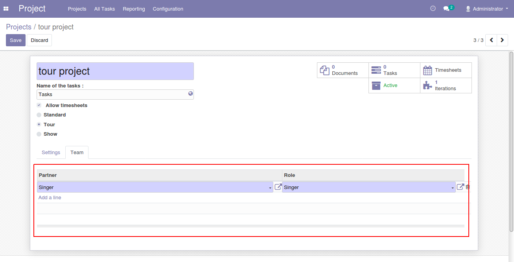
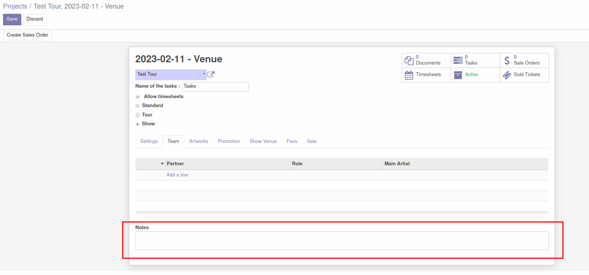

Project Role Show
=================

Description
-----------

This module adds a menu Tour Role under Project -> Configuration which will allow Project Manager to create tour roles.

Project Member model is created as well. Project Manager can add project member into project when project type is tour or show.

New field **Notes** is created in "Team" tab of the project model.

Configuration
-------------

No configuration required apart from module installation.

Contributors
------------
* Numigi (tm) and all its contributors (https://bit.ly/numigiens)
* Komit (https://komit-consulting.com)

More information
----------------
* Meet us at https://bit.ly/numigi-com
