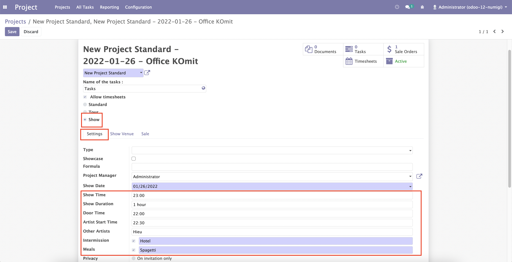
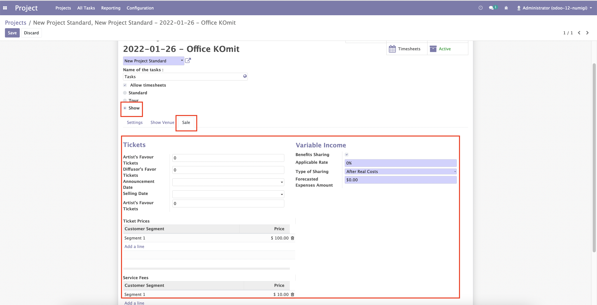
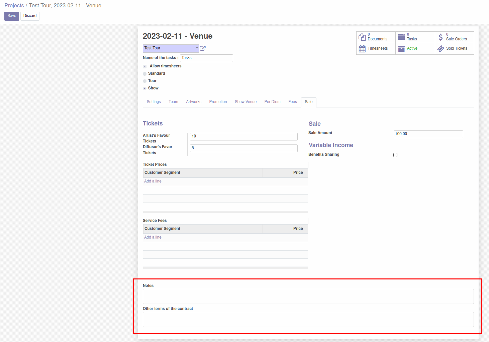

Show Project Sale
=================
Description
-----------

This module will add more information on Project Form with Type is Show

Add new field on "Configuration Tab" when Project Type is Show

Add new tab "Sale" when Project Type is Show

Add New fields **Notes** and **Other terms of the contract** in "Sale" tab

Configuration
-------------

No configuration required apart from module installation.

Contributors
------------

The `Numigi <https://numigi.com/r/home>`_ team is the contributor to this project. We help Quebec companies implement Odoo and Konvergo ERP.
* Komit (https://komit-consulting.com)

