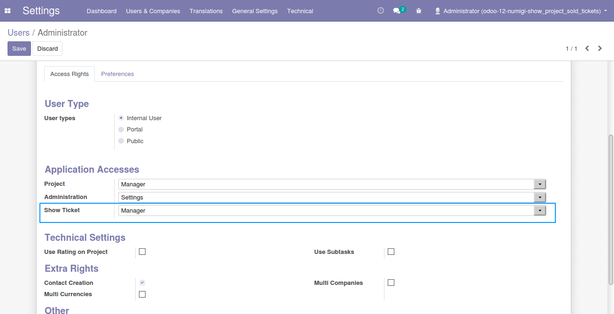
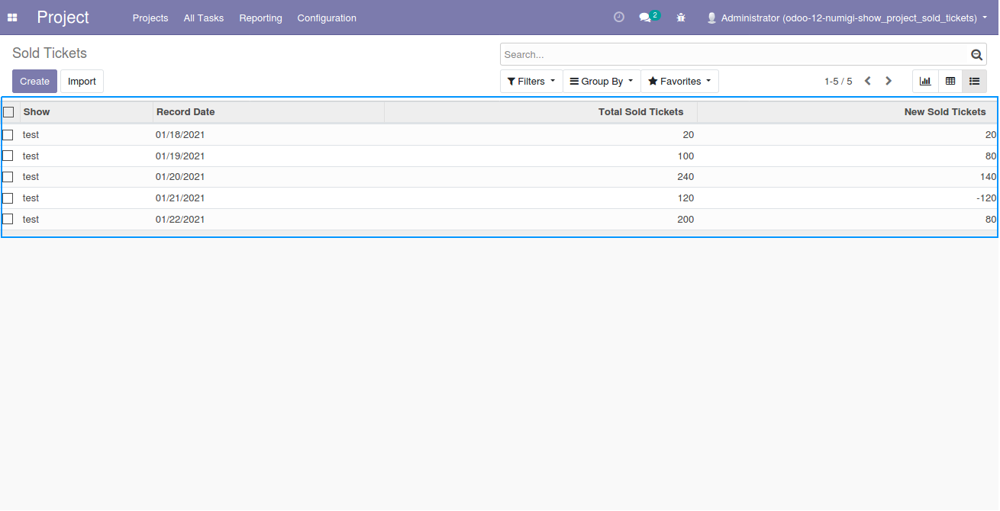
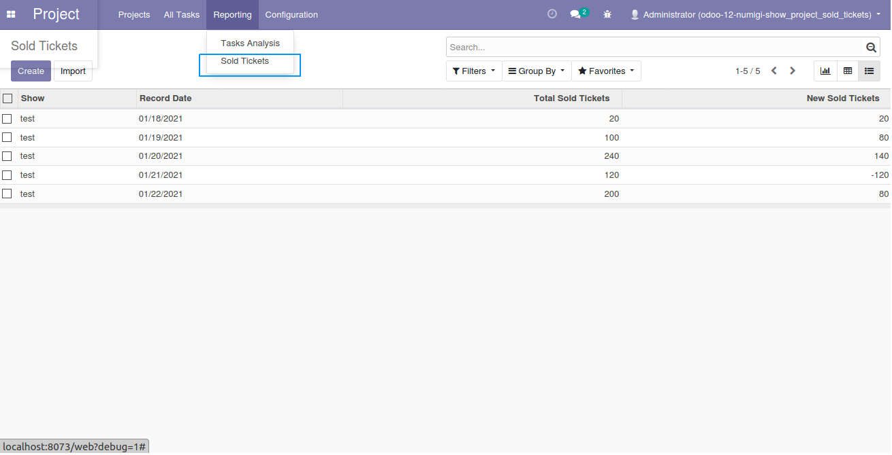
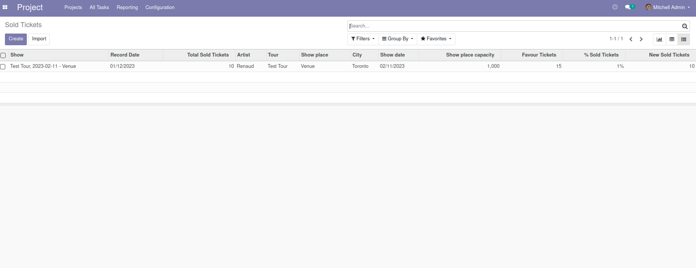
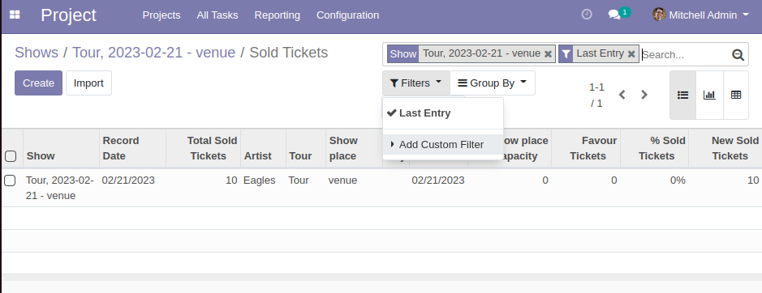

Show Project Sold Tickets
=========================

Description
-----------

This module adds a new **Show Ticket** root group on user form

Show Ticket Sold model is created as well. Only user with **Show Ticket / Manager** can create and modify.

New menu **Sold Ticket** is created under Project -> Reporting menu

New fields are created in the show ticket sold model.

New filter is added in the show ticket sold search bar.

Configuration
-------------

No configuration required apart from module installation.

Contributors
------------
* Numigi (tm) and all its contributors (https://bit.ly/numigiens)
* Komit (https://komit-consulting.com)

More information
----------------
* Meet us at https://bit.ly/numigi-com
