Show Sale
=========

This module adds sales orders of type ``Show``.

.. contents:: Table of Contents

Configuration
-------------
In the form view of a sale order type, I find a new checkbox ``Show``.

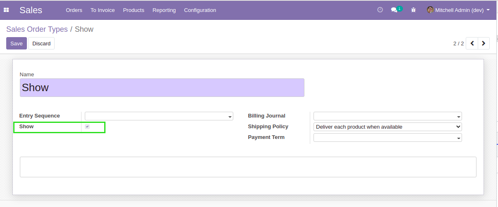

When this box is checked, on the sale order, a new tab ``Show`` is displayed.

Overview
--------
I create a new sale order and select the type ``Show``.

.. image:: static/description/sale_order_new.png

A new ``Show`` tab is displayed.

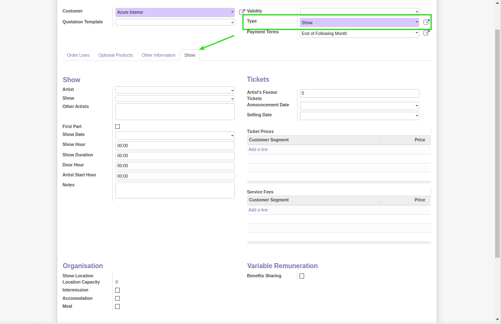

This tab allows to fill important information in the preparation of a show.

I select a project in the field ``Show``, then I save.

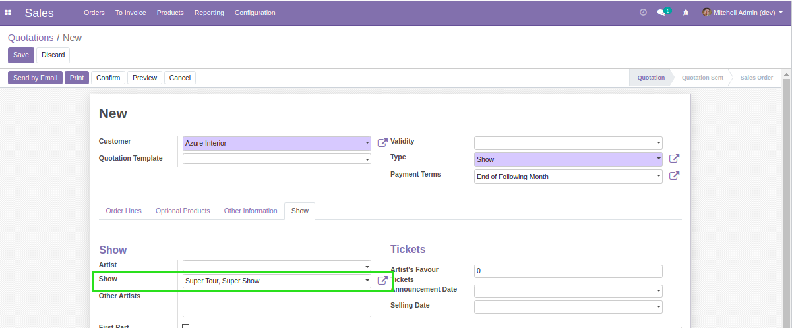

In the form view of the selected show project, I notice a new smart button.

.. image:: static/description/project_smart_button.png

When I click on the button, the list of related sale orders is displayed.

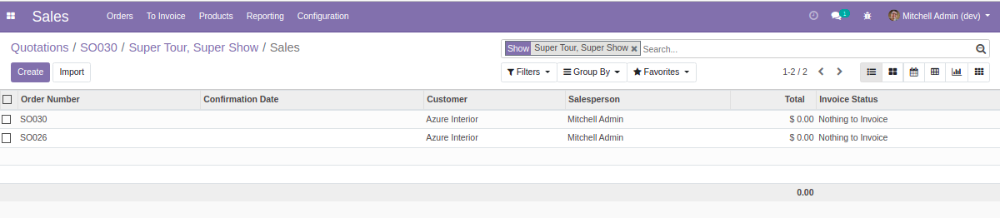

When it is no uncancelled sale order related to project with type ``Show``, I notice a new button ``Create Sale``.

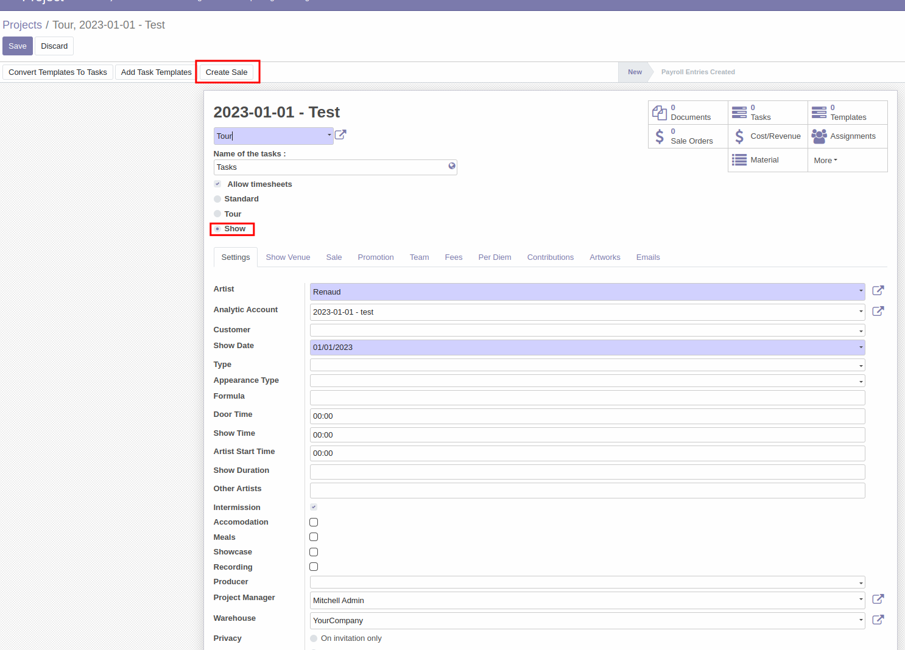

If it is no sale order type with the field ``Show`` checked and I click on ``Create Sale`` button, an error message appears.

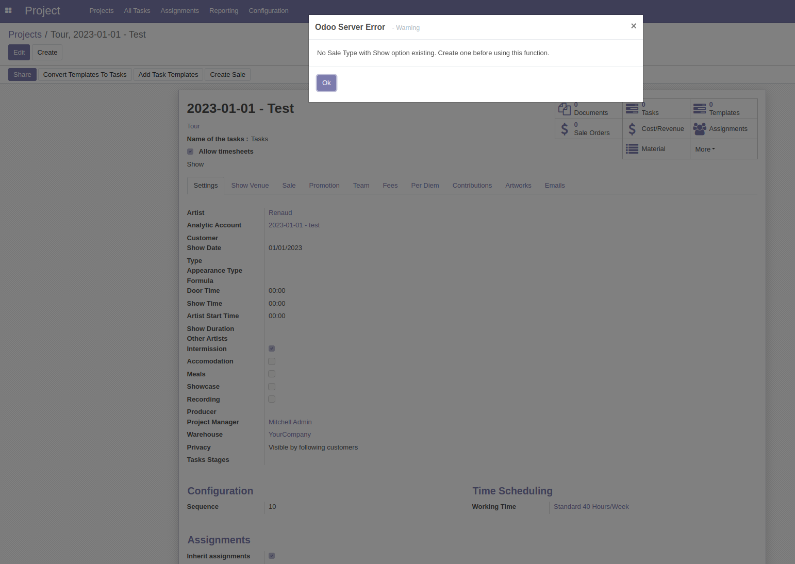

Once I create a sale order from the project,
I notice that the fields of this so ``Customer``, ``Analytic Account``, ``Show`` and ``Type`` are filled automatically.

Project form view:

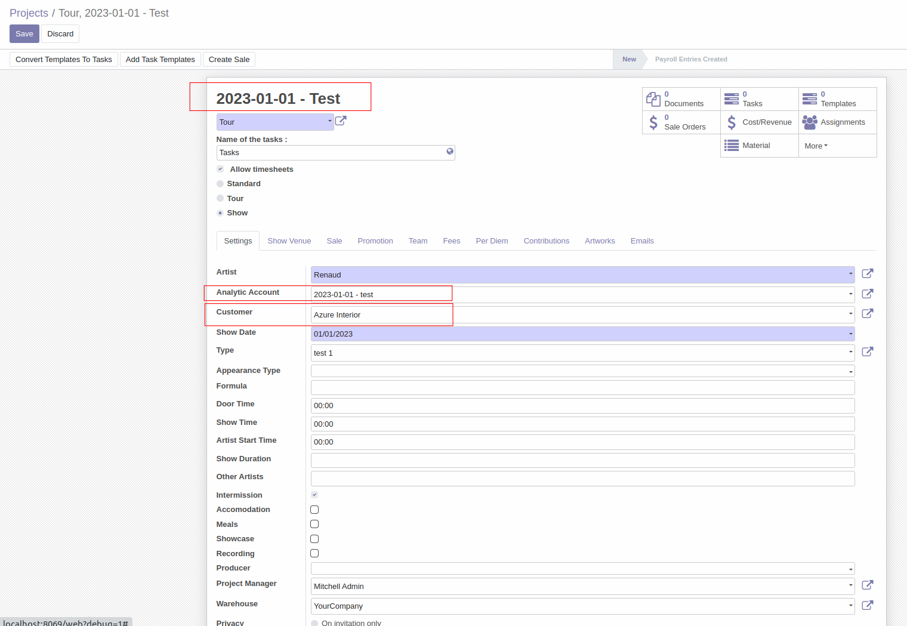

Sale form view:

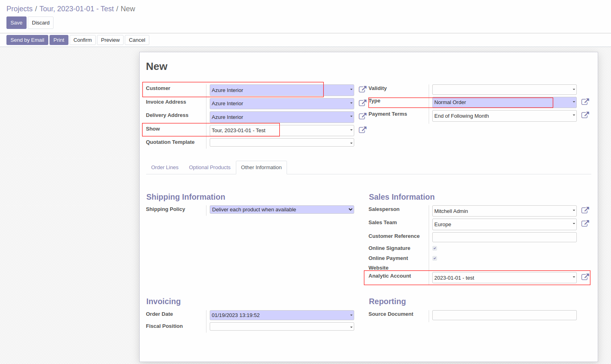

After saving the so, I go to the sale menu to create a new sale order and I select the previous project in the field ``Show``,
then a popup appears when I save.

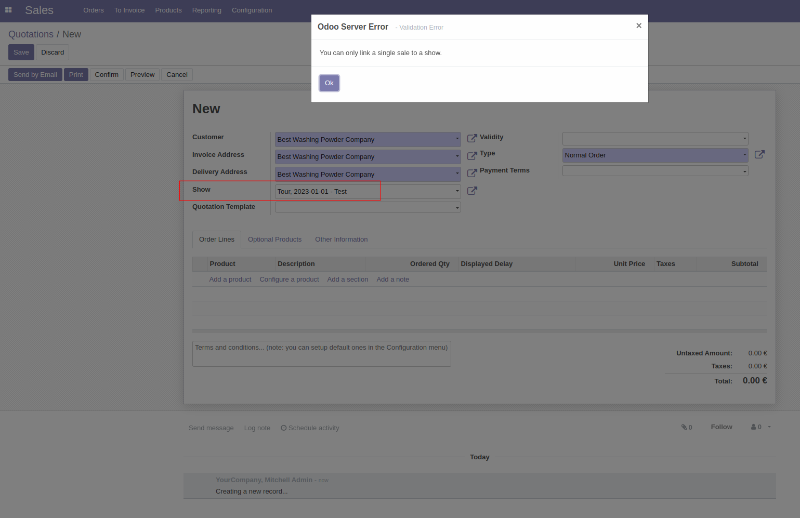

Tickets
-------
Inside the ``Tickets`` section, there are two fields ``Ticket Prices`` and ``Service Fees``.

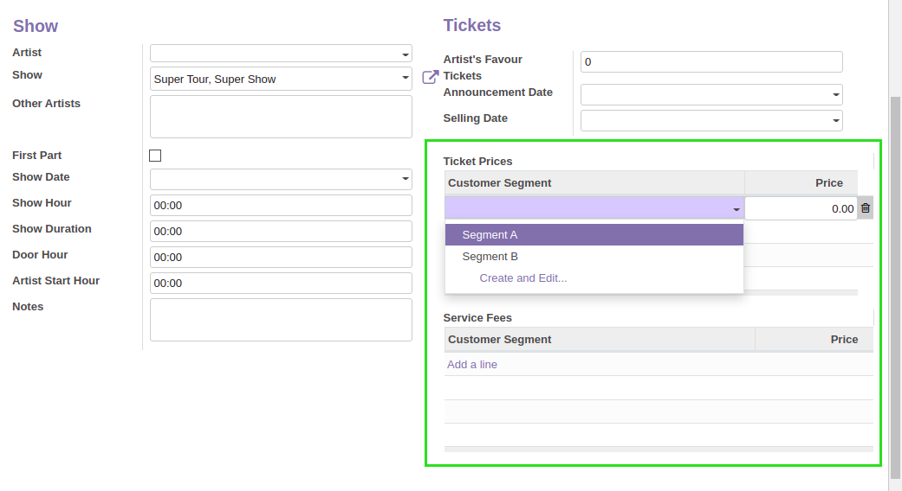

Both fields allow to select a ``Customer Segment`` and a price.

Members of the group ``Sales / Manager`` can edit customer segments.
The list of segments can be found under the menu ``Sales / Configuration / Customer Segments``.

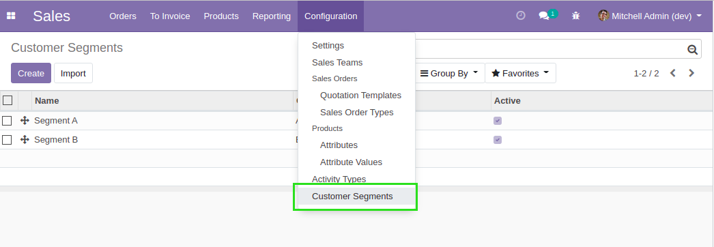

Organisation
------------
Inside the ``Organisation`` section, the fields ``Show Location`` and ``Location Capacity`` are readonly.

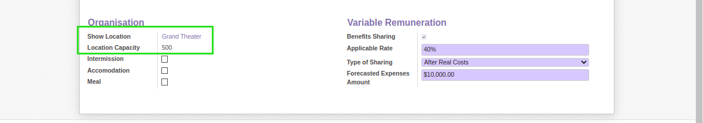

Those fields reflect the value selected on the project.

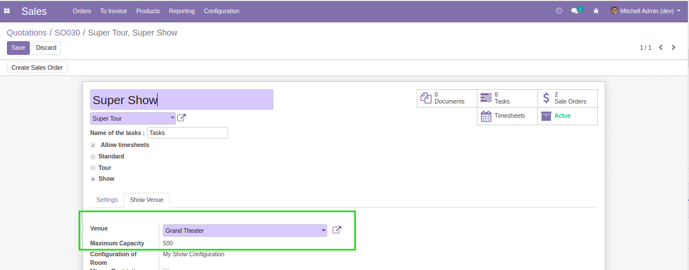

Variable Remuneration
---------------------
Inside the ``Show`` tab an optional section ``Variable Remuneration`` allows
to define a contractual profit sharing between the selling company and the client.

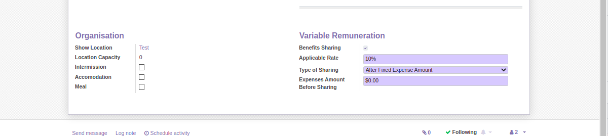

The sharing of profts can be either based on:

* A fixed expense amount
* The real cost engaged for the show

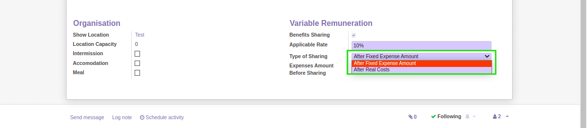

In case of a sharing based on fixed expenses, a field allows to enter the fixed expense amount.

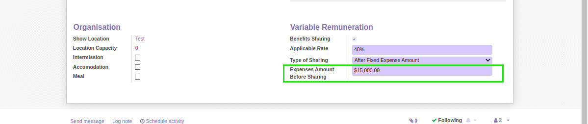

In case of a sharing based on real costs, a field allows to enter the forecasted cost for the show.

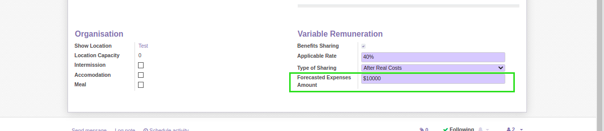

Contributors
------------
* Numigi (tm) and all its contributors (https://bit.ly/numigiens)
