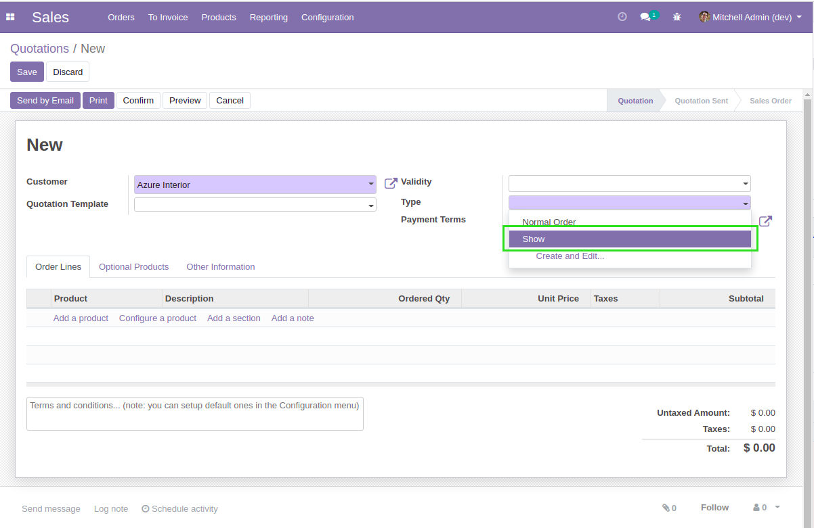

Show Sale
=========

This module adds sales orders of type ``Show``.

.. contents:: Table of Contents

Configuration
-------------
In the form view of a sale order type, I find a new checkbox ``Show``.

.. image:: static/description/sale_order_type.png

When this box is checked, on the sale order, a new tab ``Show`` is displayed.

Overview
--------
I create a new sale order and select the type ``Show``.

A new ``Show`` tab is displayed.

.. image:: static/description/sale_order_show_tab.png

This tab allows to fill important information in the preparation of a show.

I select a project in the field ``Show``, then I save.

.. image:: static/description/sale_order_show_selected.png

In the form view of the selected show project, I notice a new smart button.

.. image:: static/description/project_smart_button.png

When I click on the button, the list of related sale orders is displayed.

Organisation
------------
Inside the ``Organisation`` section, the fields ``Show Location`` and ``Location Capacity`` are readonly.

.. image:: static/description/sale_order_organisation.png

Those fields reflect the value selected on the project.

.. image:: static/description/project_show_place.png

Variable Remuneration
---------------------
Inside the ``Show`` tab an optional section ``Variable Remuneration`` allows
to define a contractual profit sharing between the selling company and the client.

The sharing of profts can be either based on:

* A fixed expense amount
* The real cost engaged for the show

In case of a sharing based on fixed expenses, a field allows to enter the fixed expense amount.

In case of a sharing based on real costs, a field allows to enter the forecasted cost for the show.

.. image:: static/description/variable_remuneration_forcasted_amount.png

Contributors
------------
* Numigi (tm) and all its contributors (https://bit.ly/numigiens)
